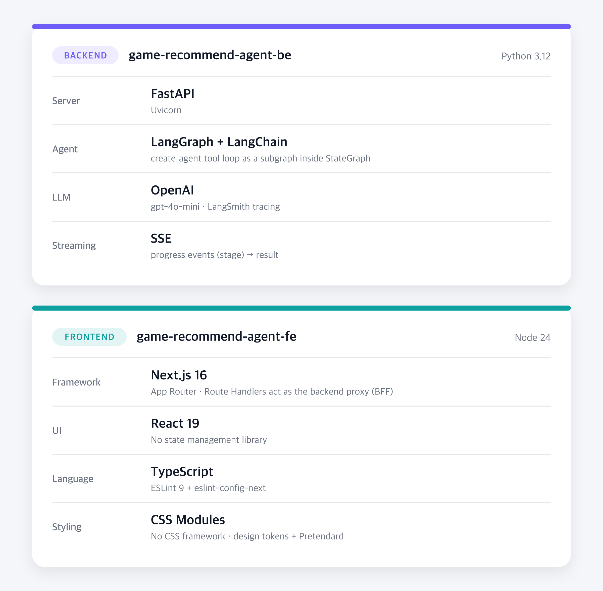
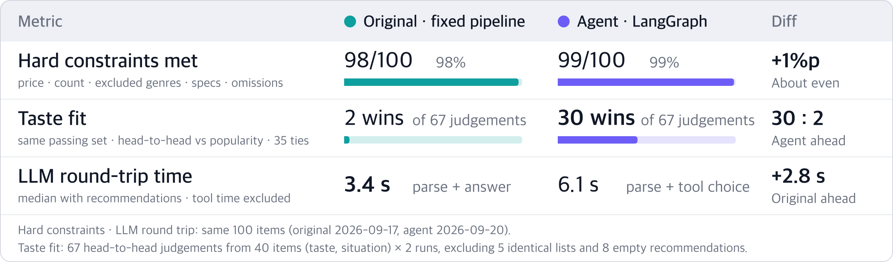
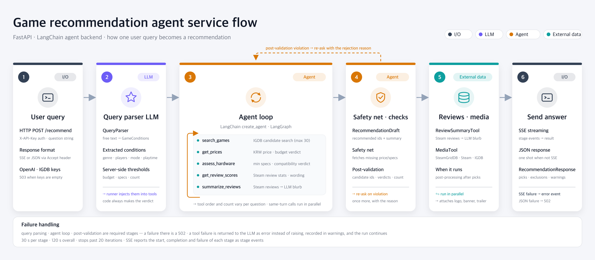
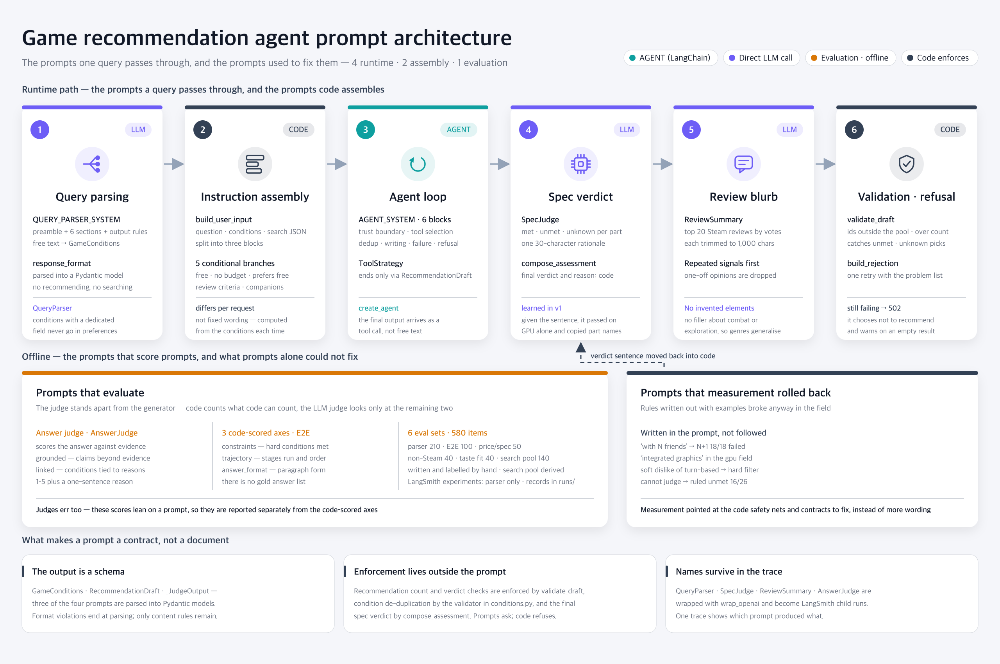

# game-recommend-agent-be backend

[한국어](README.md) · **English**

> **This file is a translation.** [README.md](README.md) (Korean) is the source of truth; where the two
> disagree, the Korean one is right. `evals/agent_questions/bench.py` also reads the example questions
> directly out of `README.md`, so edit the Korean file first and mirror the change here.
> Questions are parsed as Korean. Answers, review summaries, warnings and verdict reasons are written in
> the request's `language` (`ko` by default, or `en`).

Paths and commands are relative to the repository root.
The frontend is developed in [game-recommend-agent-fe](https://github.com/Game-Recommend/game-recommend-agent-fe),
and the deployed UI is [game-recommend-agent-fe.vercel.app](https://game-recommend-agent-fe.vercel.app/).
This repository is a copy of [game-recommend-be](https://github.com/Game-Recommend/game-recommend-be)
that rebuilds the fixed pipeline into **a structure where a LangChain agent picks and calls tools**.
Per-role tasks are in [TEAM.md](TEAM.md) (Korean).

A FastAPI server that takes hardware, taste, player count, budget, playtime and platform conditions in
natural language and recommends games that match them.

Right now the **agent layer ([app/agent/](app/agent/)) picks and calls 5 tools — IGDB search, price,
hardware, review score, review summary — and writes the final answer itself**. The original fixed
pipeline (orchestrator plus a final-answer LLM) has been removed from this repository, so before/after
comparisons are run against the original repository. Everything is wired up from `.env` at server start
([app/assembly.py](app/assembly.py)); tests inject fake integrations and a scripted model to verify the
flow. If a required key (`OPENAI_API_KEY`, `IGDB_CLIENT_ID`, `IGDB_CLIENT_SECRET`) is empty,
`POST /recommend` returns 503.

## Tech stack

| Area | Current setup |
| --- | --- |
| Runtime | Python 3.12 or later |
| HTTP server | FastAPI, Uvicorn |
| Validation & settings | Pydantic, pydantic-settings |
| HTTP client | `httpx2` |
| LLM | OpenAI SDK (question parsing, spec judging, one-line review blurbs), `langchain-openai` `ChatOpenAI` (agent) |
| Agent | LangChain 1.x `create_agent` as a subgraph inside a LangGraph `StateGraph` (parse → agent → safety net → validate/retry → post-process): tool-call loop, parallel calls within one turn, structured final output |
| Dev tooling | pytest, Ruff, Makefile |
| CI | GitHub Actions: lint, tests and a gitleaks secret scan on PRs and pushes to `main` |

Dependencies and tool configuration live in [pyproject.toml](pyproject.toml), commands in
[Makefile](Makefile), and per-role scope in [TEAM.md](TEAM.md).



The tech stack including the frontend. Edit the [SVG](docs/tech_stack.en.svg), not the PNG.
Every diagram on this page has an English twin (`*.en.svg`, `*.en.png`) beside the Korean original;
when you change one, change both.

## Example questions

The Korean text is the literal input; the italics are an English gloss.

- **Hardware**: "내 노트북이 i5-1240P, RAM 16GB, 내장그래픽인데 원활하게 할 수 있는 게임 중에서 평점 좋은 게임 추천해줘."
  *"My laptop is an i5-1240P with 16 GB of RAM and integrated graphics — recommend well-rated games that run smoothly on it."*
- **Multiplayer + party size**: "친구 4명이서 온라인으로 같이 할 게임을 찾고 있어. 경쟁보다는 협동 위주였으면 좋겠고 한 판이 너무 길지 않았으면 좋겠어."
  *"I'm looking for a game to play online with 4 friends. Co-op rather than competitive, and I'd rather a single match not run too long."*
- **Price + taste**: "지금 2만 원 이하로 살 수 있는 게임 중에서 스토리가 중요한 RPG 추천해줘. 턴제 게임은 별로 안 좋아해."
  *"Recommend a story-driven RPG I can buy for 20,000 KRW or less right now. I don't really like turn-based games."*
- **Playtime + genre**: "취업 준비하면서 가볍게 할 게임을 찾고 있어. 한 번에 30분~1시간 정도 하기 좋고, 전체 플레이타임도 15시간을 넘지 않는 싱글 게임이면 좋겠어."
  *"I'm job hunting and want something light — good for 30–60 minutes per sitting, single-player, and under 15 hours to finish."*
- **Combined conditions (for the demo)**: "RTX 3060, RAM 16GB PC를 사용하고 있어. 친구 한 명과 온라인으로 같이 할 수 있고, 공포 게임은 싫어. 3만 원 이하이면서 Steam 평가가 좋은 게임 3개만 추천해줘."
  *"I have an RTX 3060 PC with 16 GB of RAM. It should be playable online with one friend, no horror, under 30,000 KRW, well-reviewed on Steam — just 3 games."*

## Before/after comparison (fixed pipeline → agent)

The 5 questions above, run against the original
[game-recommend-be](https://github.com/Game-Recommend/game-recommend-be) (fixed pipeline) and against this
repository (agent). The original was measured on 2026-09-17 and the agent on 2026-09-20; the original
repository's app code did not change in between. Per-question details, timelines and raw records are in
[evals/agent_questions/REPORT.md](evals/agent_questions/REPORT.md).

| Question type | Original (fixed pipeline) | Agent | Tools the agent called (in order) |
| --- | --- | --- | --- |
| Hardware | 4.87 s · 0 games | 19.5 s · 5 games | search → price → hardware → review score → review summary → review score → review summary |
| Multiplayer + party size | 17.48 s · 5 games | 10.97 s · 5 games | search → price → hardware |
| Price + taste | 22.47 s · 5 games | 11.75 s · 5 games | search → hardware → price |
| Playtime + genre | 16.14 s · 5 games | 11.45 s · 4 games | search → hardware → price → review summary |
| Combined conditions (demo) | 24.77 s · 3 games | 14.52 s · 3 games | search → price → hardware → review score → review summary |

- **The order and number of tool calls differ per question.** The original always runs the same single
  lap. The agent called review score only on the two questions that asked about ratings (hardware,
  combined conditions), and skipped review summary on two questions — there the runner fills the
  summaries in after the recommendations are fixed. Tools picked in the same turn run in parallel. The
  doubled review tools on the hardware question are a retry: the first call passed an id that was not in
  the candidate list and was rejected, which is within the per-tool call limit (2 for the review tools).
- **The gap on the hardware question does not come from the structure.** The original finished
  empty-handed in 4.9 s because its question parser extracted the platform as `노트북` ("laptop"), so the
  IGDB search returned 0 results. In this repository the parser produced `PC` for the same question. The
  two repositories' parser prompts have diverged, and this one has a rule that reads "laptop games" as a
  platform ([prompts.py](app/pipeline/query_processing/prompts.py)).
- **Latency is not a pure structural difference either.** The agent runs in 11.0–19.5 s, faster than the
  original (16.1–24.8 s) on the four questions that produced recommendations. The original spends
  5.8–13.7 s on review summaries; this repository calls them per game in parallel and finishes in
  1.8–2.4 s. On the agent side there is an extra LLM round trip to pick tools.
- **The exclusion lists ended up similar.** Because the price and hardware tools look up every searched
  candidate rather than only the ones the LLM picked, on the combined-conditions question the original
  recorded 20 exclusions and the agent 19.

The 2026-09-17 agent measurement (19.7–40.1 s, back when it called the same tool repeatedly and only
looked up the candidates the LLM had picked) is kept as-is in the REPORT.

### Differences that come from the structure



A chart that keeps **only the numbers that come from the structure** (fixed pipeline vs an LLM-picked-tool
agent). Edit the [SVG](docs/eval_comparison.en.svg), not the PNG.

- **Hard-constraint satisfaction is a tie (98 vs 99).** Handing the selection to an LLM does not break
  compliance with price, spec, count and exclusion conditions, because code — not the prompt — does the
  judging and the post-validation.
- **Taste fit is what the structure buys.** From the same set of passing candidates, an LLM judge
  compared the agent's picks against what the fixed pipeline would have picked (the list truncated by
  popularity), twice per pair with the positions swapped. Out of 67 judgements: 30 wins for the agent,
  2 for popularity, 35 ties ([evals/relevance/REPORT.md](evals/relevance/REPORT.md)).
- **LLM round-trip time is what the structure costs.** The original spends 3.4 s on question parsing plus
  the final answer; the agent spends 6.1 s on question parsing plus the tool-picking reasoning (median
  over the items that produced recommendations,
  [latency_breakdown.py](evals/agent_e2e/latency_breakdown.py)).

Answer format (50 vs 94), zero-recommendation rate (19 vs 17) and overall latency (11.6 s vs 10.6 s) are
left out of the chart: those numbers diverged because of fixes made only in this repository, not because
of the structure. Answer format comes from taking the answer as a field of the structured output plus the
runner's name re-ask; the zero-recommendation rate from the empty-draft re-ask and the search fix; overall
latency from I/O patches such as parallelising the review summaries. Numbers and evidence are in
[evals/agent_e2e/REPORT.md](evals/agent_e2e/REPORT.md).

## Agent flow



The 6 stages a single query goes through to become a recommendation. Edit the
[SVG](docs/game_recommend_flow.en.svg), not the PNG. Below is the same flow with the agent loop expanded.

```text
question
  ↓
question-parsing LLM → GameConditions ───────── budget, user hardware and requested count are injected into the tools
  ↓
agent loop (LangChain create_agent, app/agent/runner.py)
  The LLM calls the tools it picks, reads the results and decides what to do next. Calls made in the same turn run in parallel.
  ├─ search_games      search IGDB for candidates matching the conditions (most-rated first, up to 30)
  ├─ get_prices        every searched candidate → KRW price and budget verdict (the LLM does not have to pass ids)
  ├─ assess_hardware   every searched candidate → minimum-spec and compatibility verdict
  ├─ get_review_scores list of candidate igdb_ids → Steam review statistics (recommend ratio, Wilson lower bound, review wording)
  └─ summarize_reviews list of final igdb_ids → one-line Steam review blurbs
  Per-tool call limits (per request): search, price, hardware 1x; review score, review summary 2x. Calls past the limit are not executed
  ↓
RecommendationDraft (list of recommended igdb_ids + a summary paragraph) ← structured final output
  ↓
runner post-validation: ids must exist in the candidate list · must pass the price/spec verdicts · must not exceed the requested count.
                        On a violation the model is called once more with the rejection reason attached.
re-asks (once each; if the second answer is the same it is accepted): recommendations are empty although passing candidates exist
                                                                     → re-ask with the passing candidates attached
                                                                     a recommended game's name is missing from the answer
                                                                     → re-ask with the missing names and the recommendation list attached
safety net: for any recommended game whose price, spec or reviews were never looked up, the runner looks them up itself
  ↓
media post-processing (logo, hero, trailer) → RecommendationResponse (same response shape as the original repository)
```

- One tool is one capability, and its argument is a list of `igdb_id`s (batched). Thresholds (budget,
  user hardware) are injected by the runner from the parsed conditions rather than passed by the LLM, so
  the verdicts are always produced by code (`app/tools/*`).
- The price and hardware tools look up **every searched candidate**, regardless of the ids the LLM passed.
  Once the candidate id list got long, the model started passing only some of the 30 or mixing in ids that
  did not exist — and a candidate that was never looked up can never be recommended.
- How many times the LLM may call the same tool is fixed per request
  ([app/agent/limits.py](app/agent/limits.py): search, price and hardware 1x; review score and review
  summary 2x). A call past the limit does not run the tool and returns a notice instead, and a tool that
  has been rejected once is dropped from the tool list on subsequent model calls. There used to be a
  question that read the reviews of passing candidates one game at a time, eight times, hit the iteration
  limit and ended in a 502. The count carries over when the loop is re-entered through a post-validation
  retry or a re-ask; safety-net and review-summary calls made by the runner itself are not counted.
- Tools return only compact JSON to the LLM; the full response models accumulate in a per-request
  `CandidateStore`.
- A tool failure is not raised as an exception — it is returned to the LLM as `{"error": ...}` and
  recorded in `warnings`. A 502 happens only on question-parsing failure, agent-loop failure (model error,
  iteration limit, or exceeding the overall 120 s budget), or post-validation failure after the retry.
- The agent model is `OPENAI_AGENT_MODEL` (falling back to `OPENAI_MODEL` when empty).
- The whole flow above is a single LangGraph `StateGraph` (`parse → agent → safety_net → validate ⇄ retry
  → judge → reviews·media → respond`). The `create_agent` loop is the `agent` subgraph node, and the
  post-validation retry is a conditional edge. `make graph` prints Mermaid with the subgraph expanded.
- Design principles and per-role tasks are in [TEAM.md](TEAM.md); the prompts are in
  [app/agent/prompts.py](app/agent/prompts.py).

## Prompt engineering



One page holding both the prompts a query passes through and the prompts used to fix those prompts.
Edit the [SVG](docs/prompt_engineering_architecture.en.svg), not the PNG.

| Prompt | What it does | Location | Output contract |
| --- | --- | --- | --- |
| `QUERY_PARSER_SYSTEM` | Extracts only the conditions from a natural-language question | [app/pipeline/query_processing/prompts.py](app/pipeline/query_processing/prompts.py) | `GameConditions` |
| `build_user_input` | Assembles the question, conditions, search JSON and conditional instructions per request | [app/agent/prompts.py](app/agent/prompts.py) | user message |
| `AGENT_SYSTEM` | Trust boundary, tool-selection procedure, answer-writing rules | [app/agent/prompts.py](app/agent/prompts.py) | `RecommendationDraft` |
| `SYSTEM_PROMPT` (spec judge) | Per-component `met`/`unmet`/`unknown` plus a 30-character rationale | [app/clients/hardware_judge.py](app/clients/hardware_judge.py) | `_JudgeOutput` |
| Review blurb | Turns the 20 most helpful Steam reviews into one ~100-character sentence | [app/clients/steam_reviews.py](app/clients/steam_reviews.py) | free-form sentence |
| `build_rejection` | Post-validation failure reasons and resubmission rules | [app/agent/prompts.py](app/agent/prompts.py) | user message |
| `build_empty_challenge` | When the draft is empty but passing candidates remain, re-asks once with that list and the meaning of `skipped` attached | [app/agent/prompts.py](app/agent/prompts.py) | user message |
| `build_name_challenge` | When a recommended game's name is missing from the answer, re-asks once with the missing names and the recommendation list attached | [app/agent/prompts.py](app/agent/prompts.py) | user message |
| `build_call_limit_notice` | The notice returned for a tool call that was not executed because it exceeded the call limit | [app/agent/prompts.py](app/agent/prompts.py) | tool result (`{"error": ...}`) |
| `JUDGE_SYSTEM` | Scores the answer paragraph on `grounded` and `linked` (offline) | [evals/agent_e2e/judge.py](evals/agent_e2e/judge.py) | `JudgeVerdict` |

- **Enforcement lives outside the prompt.** The recommendation count and the verdict checks are enforced
  by `CandidateStore.validate_draft`, condition de-duplication by the validator in `conditions.py`, the
  final spec verdict and its rationale by `compose_assessment`, and "do not call the same tool again" by
  `ToolCallLimiter`. Prompts ask; code refuses.
- **Measure before rewording.** The places where a rule broke in practice — even with examples spelled
  out — are recorded in the REPORTs under [evals/](evals/): counting `친구 N명이서` ("with N friends") as
  N+1, 18/18 failures; putting `내장그래픽` ("integrated graphics") in the GPU model-name slot; ruling
  "cannot determine" as "does not meet", 16/26.
- **Names survive in the trace.** `QueryParser`, `SpecJudge`, `ReviewSummary` and `AnswerJudge` are
  wrapped with `wrap_openai` and become LangSmith child runs, so a single trace shows which prompt
  produced what.

## Roles of the tools and external integrations

| Service tool | What it does | Integration / planned source |
| --- | --- | --- |
| `GameSearchTool` | Finds and de-duplicates candidates matching the conditions | `GameCatalogClient` / IGDB (`IgdbCatalogClient`) |
| `PriceTool` | Normalised KRW price and budget comparison | `PriceClient` / Steam (`SteamStoreClient`); candidates missing from Steam fall back to the free-games table → CheapShark + Frankfurter exchange rate (`CheapSharkClient`) |
| `HardwareTool` | Collects spec assessments; when there is no spec condition the verdict is just `skipped` | `HardwareClient` / Steam (`SteamStoreClient`), with PCGamingWiki (`PcGamingWikiClient`) for candidates missing from Steam; shared memory rules + an LLM GPU/CPU verdict (`hardware_assessor.py`, `OpenAISpecJudge`) |
| `ReviewScoreTool` | Steam review statistics used to select candidates | `ReviewScoreClient` / Steam reviews (`SteamReviewScoreClient`) |
| `ReviewSummaryTool` | Requests review summaries for the selected candidates | `ReviewSummaryClient` / Steam reviews + LLM blurb (`SteamReviewSummaryClient`, `steam_reviews.py`) |
| `MediaTool` | Logo, hero banner and trailer for the recommendation cards | `MediaClient` / SteamGridDB → Steam CDN → IGDB (`MediaResolver`) |

The LangChain tools used in agent mode (`app/agent/tools/*.py`) are thin adapters that simply call `run()`
on the service tools above. `app/tools/` holds the service roles and `app/clients/` the external
integrations. The number of external providers does not have to match the number of service tools: each
`app/clients/*.py` handles the actual calls for one provider, and `app/assembly.py` wires up adapters that
satisfy the per-role async Protocols in `app/clients/contracts/`.
Owning files and per-role test commands are collected in the [4-person development guide](TEAM.md).

### Data and failure handling

- Candidates and results are linked by `igdb_id`. A `steam_app_id` is also kept on the candidate for
  Steam lookups. Candidates additionally carry IGDB `summary`, classification (`genres`, `themes`) and
  time-to-beat (`playtime_hours`) as material for the final answer, but the price, hardware and review
  tools do not use those fields in their verdicts.
- Only candidates without a `steam_app_id` take the fallback path (`app/clients/routing.py`). For price
  that is the free-games table (`free_games.py`) → CheapShark's lowest USD price × the Frankfurter rate;
  for specs it is PCGamingWiki. Both fallbacks accept only an exact match on the normalised game name,
  and yield `unknown` when nothing matches. Without an exchange rate, a USD price is not reported as KRW.
  A fallback failure never erases the Steam result.
- The parsed conditions distinguish online/local, single/co-op/competitive, time-to-beat vs session
  length, CPU/GPU/RAM, and the recommendation count. Conditions that were not stated are not guessed.
- The search adapter must return candidates that it has verified against the stated hard search
  conditions, in priority order. The IGDB adapter's priority is **most-rated first**
  (`total_rating_count`); it looks only at main games, remakes, remasters and expansions, and assumes PC
  when no platform is stated. Classification and game modes are filtered by IGDB id, not by name (putting
  a name condition in the same array yields 0 results). If a classification word is not an IGDB genre or
  theme, it is tried as a game mode (co-op and so on), and failing that, keyword names are looked up and
  matched by keyword id on a prefix match.
  Which of the passing candidates to recommend is the agent's choice based on the question and the stated
  taste (search order only breaks ties). IGDB's time-to-beat is never substituted for session length. A
  game whose hard conditions cannot be verified at search time is not returned as a passing candidate.
- Price and hardware verdicts are `met`, `unmet` or `unknown`. When the user stated no such condition the
  verdict is `skipped`. Even when a spec condition exists, if the user's components cannot be compared
  (no model name — `i5`, `GeForce` — or Apple Silicon) the candidate is not excluded: the verdict stays
  `skipped` and only the requirements are shown (`user_spec_issue` in `hardware_assessor.py`).
- Prices are looked up for the answer even without a budget. A budget of `0원` means free games only.
  USD is never treated as a KRW price, and `PriceQuote` only ever holds a verified KRW integer.
- The hardware adapter must both collect the requirements and compare them against the user's PC. It must
  not declare a game playable from the requirement string alone. Even without a spec condition, the
  requirements are fetched for the answer and stored in `HardwareResult.requirement`. Memory is compared
  numerically, while GPU and CPU are judged for all candidates in one call by the LLM judge
  (`OpenAISpecJudge`).
- A price or hardware failure or omission is never treated as passing a hard condition. When one side
  fails, the other side's result is preserved. After all condition checks, the recommendation count is
  capped and reviews are requested.
- When there are no candidates, the downstream tools are skipped and the answer stage receives an empty
  candidate list plus the reason. Conditions are never relaxed on the service's own initiative. On a
  review failure the candidates are passed through without summaries, plus a warning.
- Each stage has a 30 s timeout by default, configurable in the constructor.
  Question-parsing failure and agent-loop failure are HTTP 502; missing integrations are 503. A search
  failure is not a 502 — the error is returned to the agent and the run ends with no recommendations.

The order of the recommendation list is the order of the agent's `recommended_igdb_ids`. The list that
preserves search order is `excluded_games`. Review scores are fetched via `get_review_scores` and used by
the agent to select candidates, but the runner does not re-sort the list afterwards.
Conversation memory is not implemented yet. Automatic retries (3 OpenAI call attempts, 1 post-validation
retry), per-tool call limits ([app/agent/limits.py](app/agent/limits.py)) and a 1-hour cache for exchange
rates and PCGamingWiki are implemented.

## Review summaries

`SteamReviewSummaryClient` in the review owner's
[steam_reviews.py](app/clients/steam_reviews.py) implements the `ReviewSummaryClient` contract. It fetches
up to 100 Steam reviews (Korean first), drops anything under 80 characters, takes the top 20 by
`votes_up`, and has OpenAI (gpt-4o-mini) write a blurb of roughly 100 characters. Games without a
`steam_app_id` are skipped with a warning. The client reads the `OPENAI_API_KEY` environment variable
directly instead of going through `Settings` ([app/__init__.py](app/__init__.py) loads `.env`).

## Review scores

`SteamReviewScoreClient` in the review owner's
[steam_review_score.py](app/clients/steam_review_score.py) collects Steam review statistics
(`total_reviews`, `recommend_ratio`, the lower bound of the 95% Wilson interval, `review_score_desc`) and
exposes them through the `get_review_scores` tool. These are **numbers used while picking candidates**
(for questions like "well-reviewed games"), whereas the blurbs from `summarize_reviews` are **sentences
used on the cards after the picking** — different jobs.

Unlike the other tools, review scores are not stored in the `CandidateStore` and therefore do not appear
in the response body (`RecommendationEvidence`). They are values the agent uses only for its decision; to
show them on the cards you would need to add a field to `EvaluatedGame` and coordinate with the frontend.
The runner's safety net does not fetch review scores on the agent's behalf either.

## Non-Steam fallbacks

Price and hardware fallbacks for candidates that are not on Steam are implemented.

| Module | Role |
| --- | --- |
| [routing.py](app/clients/routing.py) | Splits and merges Steam vs fallback clients based on whether a `steam_app_id` exists |
| [cheapshark.py](app/clients/cheapshark.py) | Checks the free-games table, then converts CheapShark's lowest USD price to KRW |
| [exchange_rate.py](app/clients/exchange_rate.py) | Frankfurter USD→KRW rate (no key needed, 1-hour cache) |
| [free_games.py](app/clients/free_games.py) | Hand-maintained list of free launcher games (LoL, Valorant, …) |
| [pcgamingwiki.py](app/clients/pcgamingwiki.py) | Reads PC requirements from PCGamingWiki's `System requirements` template and applies the same verdict rules as Steam (no key needed, 50 titles per batch, 1-hour cache) |

## Getting started

Python 3.12 or later is required.

```bash
python3 -m venv .venv
.venv/bin/pip install -e ".[dev]"
cp .env.example .env    # fill in the keys when wiring up the real API adapters
make run                # http://127.0.0.1:8000/health
```

Check first that `python3` really is Python 3.12 or later. The Makefile uses `.venv/bin/python` when it
exists and otherwise falls back to `python3` from PATH. A different interpreter can be specified as
`make run PY=python3.12`.

Once the server is up:

- Liveness: `http://127.0.0.1:8000/health`
- Swagger UI: `http://127.0.0.1:8000/docs`
- OpenAPI schema: `http://127.0.0.1:8000/openapi.json`

### Environment variables

`Settings` in [app/config.py](app/config.py) reads environment variables and the `.env` in the repository
root. Every registered key currently defaults to an empty string, and real keys are not required to start
the server. However, `/recommend` returns 503 if `API_KEY` is empty, or if a required key
(`OPENAI_API_KEY`, `IGDB_CLIENT_ID`, `IGDB_CLIENT_SECRET`) is empty so the recommender cannot be assembled.

| Variable | Used for |
| --- | --- |
| `API_KEY` | Shared secret for calling `/recommend`. Put the same value in the frontend server's environment and send it in the `X-API-Key` header |
| `IGDB_CLIENT_ID` | Twitch developer app client ID |
| `IGDB_CLIENT_SECRET` | Twitch developer app client secret |
| `STEAMGRIDDB_API_KEY` | SteamGridDB API key. Used for the logo and hero banner on the recommendation cards |
| `OPENAI_API_KEY` | OpenAI API key. Used for question parsing, GPU/CPU spec judging, review blurbs and the final answer |
| `OPENAI_MODEL` | Model for spec judging and the final answer. Defaults to `gpt-4o-mini`. Question parsing and review blurbs are pinned to `gpt-4o-mini` in their own modules. **To use the default, delete the whole line from `.env`.** Leaving an empty value such as `OPENAI_MODEL=` overrides the default and calls the API with no model name |
| `OPENAI_AGENT_MODEL` | Model for the agent (tool selection and final answer). Falls back to `OPENAI_MODEL` when empty |
| `LANGSMITH_TRACING`, `LANGSMITH_API_KEY`, `LANGSMITH_PROJECT` | Optional. With LangSmith tracing on, tool calls, prompts and tokens are recorded. Not just the agent loop — the question-parsing, spec-judging and review-blurb LLM calls land in the same trace ([app/agent/README.md](app/agent/README.md)) |

The canonical key list is [.env.example](.env.example). At server start
[app/assembly.py](app/assembly.py) reads this configuration and assembles the adapters, so filling in the
keys and running `make run` turns the recommendation feature on.
`.env` is loaded once by `load_dotenv()` in [app/__init__.py](app/__init__.py) when the app package is
imported; the places that read environment variables directly, such as `steam_reviews.py` and LangSmith
tracing, rely on that. Existing environment variables are not overwritten, so deployment values win, and
locally you should run from the repository root.

### Development and verification commands

| Command | What it does |
| --- | --- |
| `make run` | Dev server (auto-reloads on code changes) |
| `make lint` | ruff check |
| `make test` | pytest |
| `make test-query-processing` | Question-condition model tests |
| `make test-igdb` | Candidate search tool tests |
| `make test-price-hardware` | Price and hardware tests |
| `make test-reviews` | Review summary and review score tool tests |
| `make test-media` | Media tool tests |
| `make test-integration` | HTTP API, SSE and assembly tests (runs the agent with a scripted model) |
| `make test-agent` | Agent layer tests (loop, post-validation and safety net verified with a scripted model, no OpenAI) |
| `make test-evals` | Offline checks of the eval scorers and runners (no real API calls) |
| `make graph` | Prints the recommendation pipeline graph (including the agent subgraph) as Mermaid |

Test options are passed like `make test ARGS="-q"`. `make test-llm` is a compatibility alias for
`make test-query-processing`. The tests use per-role fake integrations and verify neither real external
API calls nor LLM output quality.

`pytest`'s `testpaths` are `tests` and `evals`. The `test_*.py` files under [evals/](evals/) are offline
checks that use only mocked responses and stored data, so they run alongside the main tests; `run_eval.py`
and `judge.py`, which call real APIs and LLMs, are scripts rather than tests and are not collected. New
eval tests that are slow or cost money should be separated with a marker.

Setting `LANGSMITH_TRACING=true` in `.env` also turns tracing on during tests, and LangSmith serialises
the run input — which drains the message iterator of the scripted model (`ScriptedChatModel`) before the
model is called and makes the agent and integration tests fail. Locally, run
`LANGSMITH_TRACING=false make test` (CI is unaffected because it has no `.env`).

## HTTP API

### `GET /health`

```bash
curl http://127.0.0.1:8000/health
```

Responds `200 OK` with `{"status":"ok"}`. This is a liveness check only; it does not mean the
recommendation integrations are ready.

### `POST /recommend`

```bash
curl -X POST http://127.0.0.1:8000/recommend \
  -H 'Content-Type: application/json' \
  -H "X-API-Key: $API_KEY" \
  -d '{"question":"3만 원 이하 협동 게임 3개 추천해줘"}'
```

(The question means "recommend 3 co-op games under 30,000 KRW"; the service expects Korean.)

The `X-API-Key` header is required and must match the `API_KEY` environment variable. This key belongs
only in the frontend **server's** environment and must never reach the browser. The browser has to go
through the frontend server (an API route or a server action) so that neither the backend address nor the
key is exposed. `/health` is open without a key.

`question` is a required string of 1–5,000 characters and must contain a non-whitespace character.
The recommendation count is carried in the parsed conditions as `recommendation_count`, defaulting to 5
with a range of 1–30. It is an upper bound, so fewer may come back once candidates are dropped by the
price and spec conditions.

`language` is optional and is either `ko` (the default) or `en`. The human-readable output is written in
it: `answer`, the review summary (`review.summary`), `warnings`, and the verdict reasons
(`price.check.reason`, `hardware.check.reason`). Question parsing and the `conditions` values, SSE stage
names and `detail`, and error `detail` (the 502 and the SSE `error`) stay Korean whatever the language.
Any other value returns 422.

With the integrations injected, a successful call returns these fields.

| Field | Contents |
| --- | --- |
| `conditions` | The `GameConditions` extracted from the question |
| `games` | Recommended candidates. Each item contains `game`, `price`, `hardware`, `review` and `media` |
| `excluded_games` | Candidates dropped by the price and spec checks. `review` and `media` are always `null` |
| `warnings` | Notices such as lookup failures, missing information, or no passing candidates |
| `answer` | The summary paragraph written by the final-answer LLM. A short paragraph with no markdown in the request's `language`, shown above the game cards |

`excluded_games` does not include passing candidates that merely lost out to the recommendation-count cap.

#### SSE progress stream

Sending the same `POST /recommend` with an `Accept: text/event-stream` header responds with SSE instead of
JSON. A `stage` event arrives whenever a stage starts, completes or fails, followed by a final `result` or
`error` event. With no `Accept` header, or with `application/json`, the usual JSON response is returned.

```bash
curl -N -X POST http://127.0.0.1:8000/recommend \
  -H 'Content-Type: application/json' -H 'Accept: text/event-stream' \
  -H "X-API-Key: $API_KEY" -d '{"question":"3만 원 이하 협동 게임 3개 추천해줘"}'
```

```text
event: stage
data: {"event":"stage","stage":"질문 분해","status":"started","detail":null}

event: stage
data: {"event":"stage","stage":"게임 검색","status":"completed","detail":"후보 30개"}

event: stage
data: {"event":"stage","stage":"조건 판정","status":"completed","detail":"통과 5개 중 3개 추천, 제외 20개"}

event: result
data: {"event":"result","result":{ ...same body as the JSON response... }}
```

**Stage names are Korean on the wire, even when `language` is `en`.** They are literal values, so do not
translate them in client code:
`질문 분해` (question parsing), `에이전트 추론` (agent reasoning), `게임 검색` (game search), `가격` (price),
`하드웨어` (hardware), `리뷰 점수` (review score), `리뷰 요약` (review summary), `조건 판정` (condition
verdict), `미디어` (media). `detail` strings are Korean too — for example `후보 30개` ("30 candidates") and
`통과 5개 중 3개 추천, 제외 20개` ("3 of 5 passing candidates recommended, 20 excluded").

| Event | `data` fields | Meaning |
| --- | --- | --- |
| `stage` | `stage`, `status` (`started`/`completed`/`failed`), `detail` | Stage progress. The tool stages appear inside agent reasoning in the order the LLM called them, and parallel calls within one turn may arrive interleaved |
| `result` | `result` | Done. Same body as the JSON response (`RecommendationResponse`) |
| `error` | `detail` | A required stage failed. Same sentence as the `detail` of the JSON 502 response. Optional-stage failures show up only as a `failed` `stage` event plus `warnings` |

Once the stream is open the HTTP status is always 200, and a `: keep-alive` comment line is sent after
15 s without events. Authentication failures (401), missing configuration (503) and validation failures
(422) are returned as usual, before the stream opens. If the client disconnects, the in-flight agent run
is cancelled.
When the frontend server turns progress display on, its proxy (`src/lib/backend.ts`) adds
`Accept: text/event-stream` and streams the body through without buffering. The stage names the progress
UI knows are the frontend's `PIPELINE_FLOW` (question parsing, agent reasoning, condition verdict, media)
and `AGENT_TOOL_STAGES` (game search, price, hardware, review score, review summary), so adding a tool or
changing `STAGE` requires a matching frontend change.
For the exact nested fields, see the [response models](app/schemas/recommendation.py) and the Swagger UI.
A full example for frontend development is
[recommend_response.json](tests/integration/examples/recommend_response.json).

`media` is for the card UI and is only filled in when the media tool is injected
([models](app/schemas/media.py)).

| Field | Contents | Source order |
| --- | --- | --- |
| `logo_url` | Transparent logo, shown instead of the name in the game list. Falls back to the name as text | SteamGridDB → Steam CDN |
| `hero_url`, `hero_width`, `hero_height` | Hero banner. 1920×620-class art is preferred, otherwise 16:9 artwork | SteamGridDB → Steam CDN → IGDB |
| `trailer_youtube_id` | Trailer laid over the banner. `youtube.com/embed/{id}?autoplay=1&mute=1` | IGDB |

Games that are not on Steam (LoL and the like) skip the Steam CDN step, and SteamGridDB only links an
entry whose normalised name matches exactly. The `*_source` fields say which source filled each value.

| Status code | Meaning |
| --- | --- |
| `200` | The recommendation flow finished. Returned even with no passing candidates, as long as answer generation succeeded. For SSE, always 200 once the stream is open |
| `401` | `X-API-Key` is missing or does not match `API_KEY` |
| `422` | Request validation failed (verifiable once the integrations are injected) |
| `502` | Question-parsing failure, agent-loop failure (model error, iteration limit, or exceeding the overall 120 s budget), or post-validation failure after the retry |
| `503` | `API_KEY` is unset, or a required key is empty so the recommender was not assembled (no `app.state.recommender`) |

Sending the recommendation request above to a server started without the required keys returns this
error (the message is Korean):

```json
{"detail":"추천 서비스의 외부 연동이 설정되지 않았습니다. 누락된 환경 변수: OPENAI_API_KEY, IGDB_CLIENT_ID, IGDB_CLIENT_SECRET"}
```

In environments that do not run the lifespan (Vercel serverless and similar), the same assembly happens on
the first `/recommend` request.

## Deployment settings

- Root Directory: repository root (`.`)
- App: FastAPI
- Vercel entrypoint declaration: `app.main:app` (`tool.vercel.entrypoint` in `pyproject.toml`)
- Environment variables: configured on the Vercel project following `.env.example`

`app/main.py` has no CORS middleware. The design assumes the browser never calls the backend directly and
the frontend server calls it with `X-API-Key` attached, so no CORS allowance is needed. The backend's
deployment address is not written down in the repository or the docs — it is passed only through the
frontend server's environment variables.
[GitHub Actions](.github/workflows/ci.yml) runs lint, tests and a gitleaks secret scan; there is no deploy
step. To require CI success before merging, configure GitHub branch rules.

## Assembling the real integrations

At startup the lifespan in `app/main.py` calls `assemble()` in [app/assembly.py](app/assembly.py) to wire
up the implementations below and stores the result in `app.state.recommender`. On shutdown it closes the
shared HTTP and OpenAI clients. The logic lives in each owning module; `assembly.py` only lines up the
constructor arguments.

| Stage | Implementation | Owning module |
| --- | --- | --- |
| Question parsing | `LLMQueryParser` | `app/pipeline/query_processing/llm_parser.py` |
| Game search | `IgdbCatalogClient` → `search()` | `app/clients/igdb.py` |
| Price | `RoutedPriceClient(SteamStoreClient, CheapSharkClient)` | `app/clients/steam_store.py`, `routing.py`, `cheapshark.py` |
| Hardware | `RoutedHardwareClient(SteamStoreClient, PcGamingWikiClient)` + `OpenAISpecJudge` | `app/clients/steam_store.py`, `pcgamingwiki.py`, `hardware_judge.py` |
| Review summary | `SteamReviewSummaryClient` | `app/clients/steam_reviews.py` |
| Review score | `SteamReviewScoreClient` | `app/clients/steam_review_score.py` |
| Media | `MediaResolver(SteamGridDBClient, IgdbMediaClient)` | `app/clients/media.py` |
| Recommender | `AgentRecommender(LLMQueryParser, ToolSet, ChatOpenAI)` | `app/agent/runner.py` |

The price and hardware tools receive the same `SteamStoreClient` instance so that appdetails is fetched
only once. Without `STEAMGRIDDB_API_KEY`, logos and banners come only from the Steam CDN and IGDB.
To exercise the whole flow without an HTTP server, run this from the repository root:

```bash
.venv/bin/python -m app.assembly "3만 원 이하 협동 게임 3개 추천해줘"
```

For media alone: `python -m app.clients.media "Elden Ring" "League of Legends"`.
To plug in a different implementation, set `app.state.recommender` yourself before the server starts — the
lifespan does not overwrite an already-injected recommender. Per-role test doubles live in
`tests/<area>/fakes.py`, and `tests/integration/conftest.py` shows how to assemble with them.

## Directory layout

```text
.github/workflows/ci.yml    Python 3.12 lint and tests
.env.example               Example environment variables for the external integrations
pyproject.toml             Dependencies, build, pytest, Ruff and Vercel configuration
Makefile                   Dev server and verification commands
TEAM.md                    Per-role owning files and connection contracts
docs/game_recommend_flow.*  Service flow diagram (PNG for docs, SVG for editing)
docs/eval_comparison.*     The three rows that come from the structure: constraint satisfaction, taste fit, LLM round trip (PNG made with rsvg-convert -z 2)
docs/prompt_engineering_architecture.*  Prompt map: the runtime path plus evaluation and enforcement
docs/tech_stack.*          Backend and frontend tech stack on one page
docs/*.en.*                English twins of the four diagrams above; change both when you edit one
app/
├─ main.py                  FastAPI app. Assembles on startup, cleans up clients on shutdown
├─ assembly.py              Builds the ToolSet from .env settings and assembles the agent recommender
├─ config.py                .env settings (including OPENAI_AGENT_MODEL)
├─ agent/                   Agent layer (integration owner builds the skeleton, tool files belong to the domain owners)
│  ├─ context.py            Shared contracts: ToolSet · AgentContext(run_stage) · CandidateStore
│  ├─ runner.py             StateGraph (create_agent subgraph) · post-validation/retry · safety net · post-processing · stream()
│  ├─ limits.py             Per-tool call limits and the ToolCallLimiter middleware that enforces them
│  ├─ progress.py           Progress callbacks · PipelineStageError · stream_progress() · Recommender contract
│  ├─ prompts.py            Question-processing owner: system prompt · condition description · user input · rejection wording
│  ├─ schemas.py            RecommendationDraft, the final output
│  └─ tools/
│     ├─ search.py          IGDB owner: search_games
│     ├─ price.py           Price/hardware owner: get_prices (reference example)
│     ├─ hardware.py        Price/hardware owner: assess_hardware
│     ├─ review_score.py    Review owner: get_review_scores
│     └─ reviews.py         Review owner: summarize_reviews
├─ api/
│  ├─ routes.py             /health, /recommend (JSON or SSE), SSE encoder
│  └─ dependencies.py       Injects the assembled recommender
├─ pipeline/
│  └─ query_processing/     Question-processing owner: condition models · parser contract · LLM implementation · prompts
├─ tools/
│  ├─ game_search.py        Candidate search
│  ├─ price.py              KRW price and budget verdict
│  ├─ hardware.py           Requirements and compatibility verdict
│  ├─ review_score.py       Steam review statistics (for candidate selection)
│  ├─ review_summary.py     One-line Steam review blurbs
│  └─ media.py              Card media (optional)
├─ clients/
│  ├─ contracts/            catalog.py · price.py · hardware.py · reviews.py · review_score.py · media.py
│  ├─ igdb.py               IGDB owner: candidate search `search()` and the `IgdbCatalogClient` adapter (reuses the Twitch app token)
│  ├─ steam_store.py        Price/hardware owner: Steam appdetails API client (price and specs)
│  ├─ hardware_assessor.py  Price/hardware owner: spec verdict rules shared by Steam and the fallback
│  ├─ hardware_judge.py     Price/hardware owner: GPU/CPU judge contract and its OpenAI implementation
│  ├─ routing.py            Price/hardware owner: splits Steam vs fallback on the presence of steam_app_id
│  ├─ cheapshark.py         Price/hardware owner: non-Steam price fallback (free-games table → CheapShark)
│  ├─ exchange_rate.py      Price/hardware owner: Frankfurter USD→KRW rate
│  ├─ free_games.py         Price/hardware owner: table of free launcher games
│  ├─ pcgamingwiki.py       Price/hardware owner: non-Steam requirements fallback
│  ├─ steam_reviews.py      Review owner: Steam review collection and LLM blurbs (SteamReviewSummaryClient)
│  ├─ steam_review_score.py Review owner: Steam review statistics (SteamReviewScoreClient)
│  ├─ steamgriddb.py        Media owner: SteamGridDB logos and heroes
│  ├─ igdb_media.py         Media owner: IGDB artwork and trailers
│  └─ media.py              Media owner: MediaResolver, merging the three sources in fallback order
└─ schemas/
   ├─ game.py               IGDB owner: candidate model
   ├─ price.py              Price/hardware owner: price model
   ├─ hardware.py           Price/hardware owner: spec model
   ├─ review.py             Review owner: summary model
   ├─ media.py              Media owner: card media model
   ├─ common.py             Shared: condition verdict states
   └─ recommendation.py     Shared: recommendation evidence · HTTP request/response
tests/
├─ agent/                   Agent layer: loop, tool adapters and candidate store verified with ScriptedChatModel
├─ query_processing/        Question-processing owner's tests and doubles
├─ igdb/                    IGDB owner's tests and doubles
├─ price_hardware/          Price/hardware owner's tests and doubles
├─ reviews/                 Review owner's tests and doubles
├─ media/                   Media owner's tests and doubles
└─ integration/             HTTP API, SSE and assembly tests (runs the agent with a scripted model)

evals/
├─ agent_questions/         Before/after comparison of the 5 example questions, fixed pipeline vs agent (real APIs, excluded from CI)
├─ agent_e2e/               End-to-end 100-item evaluation (conditions, trajectory, answer format + LLM judge; same code as the original repository)
├─ parser_conditions/       Question-parsing evaluation (210 condition-extraction items)
├─ relevance/               Taste-fit evaluation (the agent's picks vs popularity-ordered picks, head-to-head)
├─ non_steam/               Field evaluation of the non-Steam fallbacks
├─ search_pool/             IGDB search candidate-pool evaluation (no LLM: release year, diversity, purchasability, empty results)
└─ price_hardware/          Price and hardware evaluation set
```
