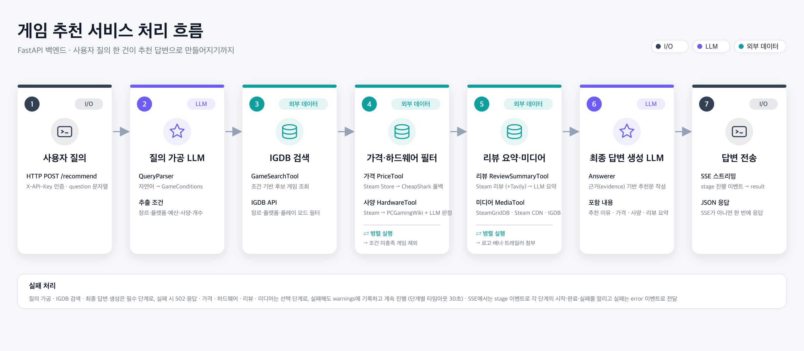
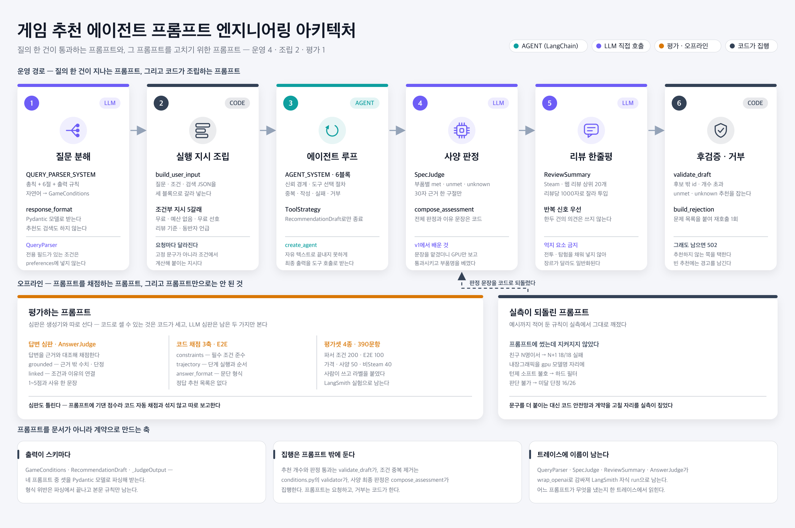

# game-recommend-agent-be 백엔드

경로와 명령은 저장소 루트를 기준으로 합니다.
프론트엔드는 [game-recommend-agent-fe](https://github.com/Game-Recommend/game-recommend-agent-fe)에서 개발합니다.
이 저장소는 [game-recommend-be](https://github.com/Game-Recommend/game-recommend-be)를 복사해
고정 파이프라인을 **LangChain 에이전트가 Tool을 골라 호출하는 구조**로 바꾸는 전환판입니다.
역할별 할 일은 [TEAM.md](TEAM.md)에 있습니다.

하드웨어·취향·인원 수·예산·플레이타임·플랫폼 조건을 자연어로 받아, 조건에 맞는 게임을 추천하는 FastAPI 서버입니다.

현재는 **에이전트 계층([app/agent/](app/agent/))이 IGDB 검색·가격·사양·리뷰 Tool 4개를 골라 호출하고
최종 답변까지 쓰는 단계**입니다. 원본의 고정 파이프라인(오케스트레이터·최종 답변 LLM)은 이 저장소에서 제거했으며
전후 비교는 원본 저장소로 합니다. 서버 시작 시 `.env` 설정으로 자동 조립하며([app/assembly.py](app/assembly.py)),
테스트에서는 가짜 연동과 대본 모델을 주입해 흐름을 검증합니다. 필수 키(`OPENAI_API_KEY`, `IGDB_CLIENT_ID`,
`IGDB_CLIENT_SECRET`)가 비어 있으면 `POST /recommend`는 503을 반환합니다.

## 기술 구성

| 구분 | 현재 구성 |
| --- | --- |
| 런타임 | Python 3.12 이상 |
| HTTP 서버 | FastAPI, Uvicorn |
| 데이터 검증·설정 | Pydantic, pydantic-settings |
| HTTP 클라이언트 | `httpx2` |
| LLM | OpenAI SDK (질문 가공·사양 판정·리뷰 한줄평), `langchain-openai` `ChatOpenAI` (에이전트) |
| 에이전트 | LangGraph `StateGraph`(질문 분해 → 에이전트 → 안전망 → 후검증·재시도 → 후처리) 안에 LangChain 1.x `create_agent`를 서브그래프로: Tool 호출 루프, 같은 턴 병렬 호출, 구조화된 최종 출력 |
| 개발 도구 | pytest, Ruff, Makefile |
| CI | GitHub Actions: PR 및 `main` 푸시 시 린트·테스트 |

의존성과 도구 설정은 [pyproject.toml](pyproject.toml), 실행 명령은
[Makefile](Makefile), 역할별 개발 범위는 [TEAM.md](TEAM.md)에서 관리합니다.

## 예상 질문

- **하드웨어**: "내 노트북이 i5-1240P, RAM 16GB, 내장그래픽인데 원활하게 할 수 있는 게임 중에서 평점 좋은 게임 추천해줘."
- **멀티플레이 + 인원**: "친구 4명이서 온라인으로 같이 할 게임을 찾고 있어. 경쟁보다는 협동 위주였으면 좋겠고 한 판이 너무 길지 않았으면 좋겠어."
- **가격 + 취향**: "지금 2만 원 이하로 살 수 있는 게임 중에서 스토리가 중요한 RPG 추천해줘. 턴제 게임은 별로 안 좋아해."
- **플레이타임 + 장르**: "취업 준비하면서 가볍게 할 게임을 찾고 있어. 한 번에 30분~1시간 정도 하기 좋고, 전체 플레이타임도 15시간을 넘지 않는 싱글 게임이면 좋겠어."
- **복합 조건 (데모용)**: "RTX 3060, RAM 16GB PC를 사용하고 있어. 친구 한 명과 온라인으로 같이 할 수 있고, 공포 게임은 싫어. 3만 원 이하이면서 Steam 평가가 좋은 게임 3개만 추천해줘."

## 전후 비교 (고정 파이프라인 → 에이전트)

2026-09-17에 위 예상 질문 5개를 원본 [game-recommend-be](https://github.com/Game-Recommend/game-recommend-be)
(고정 파이프라인)와 이 저장소(에이전트)로 각각 실행한 결과입니다. 질문별 상세·타임라인·원시 기록은
[evals/agent_questions/REPORT.md](evals/agent_questions/REPORT.md)에 있습니다.

| 질문 유형 | 원본 (고정 파이프라인) | 에이전트 | 에이전트가 부른 Tool (순서) |
| --- | --- | --- | --- |
| 하드웨어 | 4.87초 · 0개 | 30.05초 · 3개 | 게임 검색 → 하드웨어 → 리뷰 점수 → 리뷰 요약 → 가격 |
| 멀티플레이 + 인원 | 17.48초 · 5개 | 27.07초 · 5개 | 게임 검색 → 가격 → 하드웨어 → 리뷰 점수 → 리뷰 요약 → 리뷰 요약 |
| 가격 + 취향 | 22.47초 · 5개 | 28.76초 · 5개 | 게임 검색 → 가격 → 하드웨어 → 리뷰 점수 → 리뷰 요약 |
| 플레이타임 + 장르 | 16.14초 · 5개 | 40.07초 · 5개 | 게임 검색 → 가격 → 하드웨어 → 리뷰 점수 → 리뷰 요약 |
| 복합 조건 (데모용) | 24.77초 · 3개 | 19.71초 · 2개 | 게임 검색 → 가격 → 하드웨어 → 리뷰 점수 → 리뷰 요약 → 리뷰 요약 |

- **검색이 비면 고정 파이프라인은 거기서 끝납니다.** 하드웨어 질문에서 원본은 충족 후보를 찾지 못해
  4.9초 만에 빈손으로 끝냈고, 에이전트는 검색 인자를 LLM이 정해 후보 30개를 얻고 3개를 추천했습니다.
- **도구 순서와 횟수가 질문마다 달라집니다.** 원본은 늘 같은 한 바퀴이고, 에이전트는 사양을 먼저 보거나
  리뷰 요약을 두 번 부릅니다. 같은 턴에 고른 도구는 병렬로 실행합니다.
- **대신 느립니다.** 원본 4.9~24.8초, 에이전트 19.7~40.1초입니다. 도구를 고르는 LLM 왕복이 더해집니다.
- **제외 목록은 에이전트가 얇습니다.** 복합 조건 질문에서 원본은 20개를 제외 근거로 남겼지만 에이전트는
  1개입니다. LLM이 고른 후보만 조회하고, 조회하지 않은 후보는 판단한 적이 없어 제외에 넣지 않습니다.

## 에이전트 흐름



질의 한 건이 추천 답변이 되기까지의 6단계입니다. 고칠 때는 [SVG](docs/game_recommend_flow.svg)를 씁니다.
아래는 같은 흐름에서 에이전트 루프를 자세히 본 것입니다.

```text
질문
  ↓
질문 분해 LLM → GameConditions ──────────────── 예산·사용자 사양·추천 개수를 Tool에 주입
  ↓
에이전트 루프 (LangChain create_agent, app/agent/runner.py)
  LLM이 고른 Tool을 호출하고 결과를 읽어 다음 행동을 정한다. 같은 턴의 여러 호출은 병렬이다.
  ├─ search_games      조건으로 IGDB 후보 검색 (최대 30개)
  ├─ get_prices        후보 igdb_id 목록 → 원화 가격·예산 판정
  ├─ assess_hardware   후보 igdb_id 목록 → 최소 사양·호환 판정
  ├─ get_review_scores 후보 igdb_id 목록 → Steam 리뷰 통계 (추천 비율·Wilson 하한·평가 문구)
  └─ summarize_reviews 최종 후보 igdb_id 목록 → Steam 리뷰 한줄평
  ↓
RecommendationDraft (추천 igdb_id 목록 + 상단 요약 문단) ← 구조화된 최종 출력
  ↓
러너 후검증: 후보에 있는 id · 가격/사양 판정 통과 · 요청 개수 이하. 위반하면 거부 사유를 붙여 한 번 더 호출
안전망: 추천 후보 중 가격·사양·리뷰를 조회하지 않은 게임은 러너가 직접 조회
  ↓
미디어(로고·배너·트레일러) 후처리 → RecommendationResponse (원본 저장소와 같은 응답 형태)
```

- Tool 하나는 기능 하나이고 인자는 `igdb_id` 목록(배치)입니다. 기준값(예산·사양)은 LLM이 넘기지 않고
  러너가 질문 분해 결과에서 주입하므로, 판정은 항상 코드(`app/tools/*`)가 합니다.
- Tool은 LLM에 압축 JSON만 돌려주고 응답용 전체 모델은 요청 단위 `CandidateStore`에 쌓습니다.
- Tool 실패는 예외로 올리지 않고 `{"error": ...}`로 LLM에 돌려주며 `warnings`에 남깁니다. 502는 질문 분해 실패,
  에이전트 루프 실패(모델 오류·반복 상한·전체 120초 초과), 재시도 후에도 후검증 실패일 때만 납니다.
- 에이전트 모델은 `OPENAI_AGENT_MODEL`(비어 있으면 `OPENAI_MODEL`)입니다.
- 위 흐름 전체가 LangGraph `StateGraph` 하나입니다(`parse → agent → safety_net → validate ⇄ retry → judge →
  reviews·media → respond`). `create_agent` 루프는 `agent` 서브그래프 노드이고, 후검증 재시도는 조건부
  엣지입니다. `make graph`가 서브그래프까지 펼친 Mermaid를 출력합니다.
- 설계 원칙과 역할별 할 일은 [TEAM.md](TEAM.md), 프롬프트는 [app/agent/prompts.py](app/agent/prompts.py)입니다.

## 프롬프트 엔지니어링



질의 한 건이 지나는 프롬프트와, 그 프롬프트를 고치려고 쓰는 프롬프트를 한 장에 모았습니다.
고칠 때는 [SVG](docs/prompt_engineering_architecture.svg)를 씁니다.

| 프롬프트 | 하는 일 | 위치 | 출력 계약 |
| --- | --- | --- | --- |
| `QUERY_PARSER_SYSTEM` | 자연어 질문에서 조건만 뽑는다 | [app/pipeline/query_processing/prompts.py](app/pipeline/query_processing/prompts.py) | `GameConditions` |
| `build_user_input` | 질문·조건·검색 JSON과 조건부 실행 지시를 요청마다 조립 | [app/agent/prompts.py](app/agent/prompts.py) | 사용자 메시지 |
| `AGENT_SYSTEM` | 신뢰 경계·도구 선택 절차·답변 작성 규칙 | [app/agent/prompts.py](app/agent/prompts.py) | `RecommendationDraft` |
| `SYSTEM_PROMPT` (사양 판정) | 부품별 `met`·`unmet`·`unknown`과 30자 근거 | [app/clients/hardware_judge.py](app/clients/hardware_judge.py) | `_JudgeOutput` |
| 리뷰 한줄평 | Steam·웹 리뷰 상위 20개를 100자 한 문장으로 | [app/clients/steam_reviews.py](app/clients/steam_reviews.py) | 자유 문장 |
| `build_rejection` | 후검증 실패 사유와 재제출 규칙 | [app/agent/prompts.py](app/agent/prompts.py) | 사용자 메시지 |
| `JUDGE_SYSTEM` | 답변 문단의 `grounded`·`linked` 채점 (오프라인) | [evals/agent_e2e/judge.py](evals/agent_e2e/judge.py) | `JudgeVerdict` |

- **집행은 프롬프트 밖에 둡니다.** 추천 개수와 판정 통과는 `CandidateStore.validate_draft`가, 조건 중복
  제거는 `conditions.py`의 validator가, 사양 최종 판정과 이유 문장은 `compose_assessment`가 집행합니다.
  프롬프트는 요청하고, 거부는 코드가 합니다.
- **문구를 고치기 전에 잽니다.** 예시까지 적어 둔 규칙이 실측에서 깨진 자리는 [evals/](evals/)의 REPORT에
  있습니다(`친구 N명이서`를 N+1로 세는 실패 18/18, `내장그래픽`을 GPU 모델명 자리에, 판단 불가를 미달로
  단정 16/26).
- **트레이스에 이름이 남습니다.** `QueryParser`·`SpecJudge`·`ReviewSummary`·`AnswerJudge`가 `wrap_openai`로
  감싸져 LangSmith 자식 run이 되므로, 어느 프롬프트가 무엇을 냈는지 한 트레이스에서 읽힙니다.

## 도구와 외부 연동의 역할

| 서비스 도구 | 하는 일 | 연동 구현 위치 / 예정 출처 |
| --- | --- | --- |
| `GameSearchTool` | 조건에 맞는 후보 조회·중복 제거 | `GameCatalogClient` / IGDB (`IgdbCatalogClient`) |
| `PriceTool` | 정규화된 원화 가격과 예산 비교 | `PriceClient` / Steam (`SteamStoreClient`); Steam에 없는 후보는 무료 게임 표 → CheapShark + Frankfurter 환율 (`CheapSharkClient`) |
| `HardwareTool` | 사양 평가 결과 정리, 사양 조건 없으면 생략 | `HardwareClient` / Steam (`SteamStoreClient`), Steam에 없는 후보는 PCGamingWiki (`PcGamingWikiClient`); 공통 메모리 규칙 + GPU·CPU LLM 판정 (`hardware_assessor.py`, `OpenAISpecJudge`) |
| `ReviewSummaryTool` | 선택된 후보의 리뷰 요약 요청 | `ReviewSummaryClient` / Steam 리뷰 + LLM 한줄평 (`SteamReviewSummaryClient`, `steam_reviews.py`) |
| `MediaTool` | 추천 카드의 로고·배너·트레일러 | `MediaClient` / SteamGridDB → Steam CDN → IGDB (`MediaResolver`) |

에이전트 모드의 LangChain Tool(`app/agent/tools/*.py`)은 위 서비스 도구의 `run()`을 그대로 부르는 얇은
어댑터입니다. `app/tools/`는 서비스 역할, `app/clients/`는 외부 연동을 담당합니다. 외부 제공자 수와 서비스
도구 수는 일치할 필요가 없습니다. 공급자별 `app/clients/*.py`가 실제 호출을 담당하고,
`app/clients/contracts/`의 역할별 비동기 Protocol을 만족하는 어댑터를 `app/assembly.py`가 조립합니다.
담당 파일과 역할별 테스트 명령은 [4인 개발 가이드](TEAM.md)에 정리되어 있습니다.

### 데이터와 실패 처리

- 후보와 결과는 `igdb_id`로 연결합니다. Steam 연결용 `steam_app_id`도 후보에 보관합니다.
  후보에는 최종 답변 재료로 IGDB 소개(`summary`)·분류(`genres`, `themes`)·전체 완료 시간
  (`playtime_hours`)도 담지만, 가격·사양·리뷰 도구는 이 필드를 판정에 쓰지 않습니다.
- `steam_app_id`가 없는 후보만 폴백을 탑니다 (`app/clients/routing.py`). 가격은 무료 게임 표
  (`free_games.py`) → CheapShark USD 최저가 × Frankfurter 환율 순서이고, 사양은 PCGamingWiki입니다.
  두 폴백 모두 정규화한 게임명이 정확히 같은 결과만 인정하며, 못 찾으면 `unknown`입니다.
  환율을 받지 못하면 USD 가격을 원화로 내지 않습니다. 폴백 실패는 Steam 결과를 지우지 않습니다.
- 질문 조건은 온라인/로컬, 싱글/협동/경쟁, 전체 완료 시간/세션 시간, CPU·GPU·RAM,
  추천 개수를 구분합니다. 없는 조건은 추측하지 않습니다.
- 검색 어댑터는 명시된 필수 검색 조건을 검증한 후보를 우선순위순 반환해야 합니다.
  IGDB의 완료 시간을 세션 시간으로 대체하지 않습니다. 검색 단계에서 필수 조건을
  검증할 수 없는 게임은 충족 후보로 반환하지 않습니다.
- 가격·사양은 `met`(충족), `unmet`(미충족), `unknown`(확인 불가)로 구분합니다.
  사용자가 조건을 지정하지 않았을 때만 `skipped`(검사 생략)를 사용합니다.
- 예산이 없더라도 답변용 가격은 조회합니다. `0원` 예산은 무료 게임 조건입니다.
  USD를 그대로 원화 가격으로 취급하지 않으며 `PriceQuote`에는 검증한 원화 정수만 넣습니다.
- 하드웨어 어댑터는 요구 사양 수집과 사용자 PC 비교를 수행해야 합니다.
  요구 사양 문자열만으로 근거 없이 실행 가능하다고 판정하지 않습니다.
  사양 조건이 없어도 답변용 요구 사양은 조회해 `HardwareResult.requirement`에 담습니다.
  메모리는 숫자로 비교하고, GPU·CPU는 LLM 판정기(`OpenAISpecJudge`)가 후보 전체를 한 번에 판정합니다.
- 가격·사양 실패나 누락은 필수 조건 통과로 처리하지 않습니다. 한쪽 실패 시에도
  다른 쪽 결과는 보존합니다. 모든 조건 검사 후 추천 개수를 제한하고 리뷰를 요청합니다.
- 후보가 없으면 후속 도구를 생략하고 답변 생성 단계에 빈 후보와 이유를 전달합니다.
  조건은 임의로 완화하지 않습니다. 리뷰 실패 시 요약 없이 후보와 경고를 전달합니다.
- 각 단계의 제한 시간은 기본 30초이며 생성자에서 변경할 수 있습니다.
  질문 분해·검색·최종 답변 실패는 HTTP 502, 연동 미설정은 503입니다.

현재 순위는 검색 어댑터가 반환한 순서를 유지합니다. 리뷰 점수는 `get_review_scores`로 조회해
에이전트가 후보 선별에 쓰지만, 러너가 목록을 다시 정렬하지는 않습니다.
자동 재시도, 호출 제한, 캐시, 대화 메모리는 아직 구현하지 않았습니다.

## 리뷰 요약

리뷰 담당의 [steam_reviews.py](app/clients/steam_reviews.py)의 `SteamReviewSummaryClient`가
`ReviewSummaryClient` 계약을 구현합니다. Steam 리뷰를 한국어 우선으로 최대 100개 받아 80자 미만을
버리고 `votes_up` 순으로 20개를 고른 뒤 OpenAI(gpt-4o-mini)로 100자 내외 한줄평을 만듭니다.
`steam_app_id`가 없는 게임은 건너뛰어 경고만 남습니다. 클라이언트는 `Settings` 대신 환경 변수
`OPENAI_API_KEY`를 직접 읽습니다(`.env`는 [app/__init__.py](app/__init__.py)가 올립니다).

## 리뷰 점수

리뷰 담당의 [steam_review_score.py](app/clients/steam_review_score.py)의 `SteamReviewScoreClient`가
Steam 리뷰 통계(`total_reviews`, `recommend_ratio`, 95% Wilson 신뢰구간 하한, `review_score_desc`)를
모아 `get_review_scores` Tool로 노출합니다. "평가 좋은 게임"처럼 **후보를 고를 때 쓰는 수치**이고,
`summarize_reviews`의 한줄평은 **고른 뒤 카드에 쓰는 문장**이라 쓰임이 다릅니다.

리뷰 점수는 다른 Tool과 달리 `CandidateStore`에 담지 않아 응답 본문(`RecommendationEvidence`)에
나오지 않습니다. 에이전트가 판단에만 쓰는 값이며, 카드에 노출하려면 `EvaluatedGame`에 필드를
더하고 프론트와 맞춰야 합니다. 러너의 안전망도 리뷰 점수는 대신 조회하지 않습니다.

## 비Steam 폴백

Steam에 없는 후보용 가격·사양 폴백은 구현되어 있습니다.

| 모듈 | 역할 |
| --- | --- |
| [routing.py](app/clients/routing.py) | `steam_app_id` 유무로 Steam·폴백 클라이언트 분기·병합 |
| [cheapshark.py](app/clients/cheapshark.py) | 무료 게임 표 확인 후 CheapShark USD 최저가를 원화로 변환 |
| [exchange_rate.py](app/clients/exchange_rate.py) | Frankfurter USD→KRW 환율 (키 불필요, 1시간 캐시) |
| [free_games.py](app/clients/free_games.py) | 자체 런처 무료 게임 수동 목록 (LoL, 발로란트 등) |
| [pcgamingwiki.py](app/clients/pcgamingwiki.py) | PCGamingWiki `System requirements` 템플릿에서 PC 요구 사양 조회, Steam과 같은 판정 규칙 적용 (키 불필요, 제목 50개씩 묶음 조회, 1시간 캐시) |

## 시작하기

Python 3.12 이상이 필요합니다.

```bash
python3 -m venv .venv
.venv/bin/pip install -e ".[dev]"
cp .env.example .env    # 실제 API 어댑터 연동 시 키 채우기
make run                # http://127.0.0.1:8000/health
```

`python3`가 Python 3.12 이상인지 먼저 확인하세요. Makefile은 `.venv/bin/python`이
있으면 사용하고, 없으면 PATH의 `python3`를 사용합니다. 다른 인터프리터는
`make run PY=python3.12`처럼 지정할 수 있습니다.

서버 실행 후 다음 경로에서 확인할 수 있습니다.

- 생존 확인: `http://127.0.0.1:8000/health`
- Swagger UI: `http://127.0.0.1:8000/docs`
- OpenAPI 스키마: `http://127.0.0.1:8000/openapi.json`

### 환경 변수

[app/config.py](app/config.py)의 `Settings`는 환경 변수와 루트의 `.env`를 읽습니다.
현재 등록된 키의 기본값은 모두 빈 문자열이며, 서버 시작에 실제 키는 필요하지 않습니다.
단, `API_KEY`가 비어 있거나 필수 키(`OPENAI_API_KEY`, `IGDB_CLIENT_ID`, `IGDB_CLIENT_SECRET`)가
비어 추천기가 조립되지 않으면 `/recommend`는 503을 돌려줍니다.

| 변수 | 연동 시 용도 |
| --- | --- |
| `API_KEY` | `/recommend` 호출용 공유 비밀. 프론트 서버 환경 변수에 같은 값을 두고 `X-API-Key` 헤더로 보낸다 |
| `IGDB_CLIENT_ID` | Twitch 개발자 앱 클라이언트 ID |
| `IGDB_CLIENT_SECRET` | Twitch 개발자 앱 클라이언트 시크릿 |
| `STEAMGRIDDB_API_KEY` | SteamGridDB API 키. 추천 카드의 로고·가로 배너에 쓴다 |
| `OPENAI_API_KEY` | OpenAI API 키. 질문 가공, GPU·CPU 사양 판정, 리뷰 한줄평, 최종 답변에 쓴다 |
| `OPENAI_MODEL` | 사양 판정·최종 답변 모델. 기본값 `gpt-4o-mini`. 질문 가공·리뷰 한줄평은 담당 모듈에서 `gpt-4o-mini` 고정 |
| `OPENAI_AGENT_MODEL` | 에이전트(도구 선택·최종 답변) 모델. 비어 있으면 `OPENAI_MODEL` |
| `LANGSMITH_TRACING`, `LANGSMITH_API_KEY`, `LANGSMITH_PROJECT` | 선택. LangSmith 추적을 켜면 Tool 호출·프롬프트·토큰이 기록된다. 에이전트 루프뿐 아니라 질문 분해·사양 판정·리뷰 한줄평의 LLM 호출도 한 트레이스에 모인다([app/agent/README.md](app/agent/README.md)) |

키 목록의 기준은 [.env.example](.env.example)입니다. 서버 시작 시 [app/assembly.py](app/assembly.py)가
이 설정을 읽어 어댑터를 조립하므로, 키를 채우고 `make run`하면 추천 기능이 켜집니다.
`.env`는 [app/__init__.py](app/__init__.py)의 `load_dotenv()`가 app 패키지 import 시점에 한 번 올립니다.
`steam_reviews.py`와 LangSmith 추적처럼 환경 변수를 직접 보는 쪽이 여기에 기댑니다. 이미 있는 환경
변수는 덮어쓰지 않으므로 배포 환경 값이 우선하고, 로컬에서는 저장소 루트에서 실행합니다.

### 개발·검증 명령

| 명령 | 하는 일 |
| --- | --- |
| `make run` | 개발 서버 (코드 변경 시 자동 재시작) |
| `make lint` | ruff 검사 |
| `make test` | pytest |
| `make test-query-processing` | 질문 조건 모델 테스트 |
| `make test-igdb` | 후보 검색 도구 테스트 |
| `make test-price-hardware` | 가격·사양 테스트 |
| `make test-reviews` | 리뷰 요약 도구 테스트 |
| `make test-integration` | HTTP API·SSE·조립 테스트 (대본 모델로 에이전트를 돌린다) |
| `make test-agent` | 에이전트 계층 테스트 (대본 모델로 OpenAI 없이 루프·후검증·안전망 검증) |
| `make graph` | 추천 파이프라인 그래프(에이전트 서브그래프 포함)를 Mermaid로 출력 |

테스트 옵션은 `make test ARGS="-q"`처럼 전달합니다. `make test-llm`은
`make test-query-processing`의 호환용 별칭입니다. 테스트는 역할별 가짜 연동을
사용하며 실제 외부 API 호출이나 LLM 출력 품질은 검증하지 않습니다.

## HTTP API

### `GET /health`

```bash
curl http://127.0.0.1:8000/health
```

응답은 `200 OK`와 `{"status":"ok"}`입니다. 서버 생존 확인용이며 추천 연동 준비
상태를 의미하지 않습니다.

### `POST /recommend`

```bash
curl -X POST http://127.0.0.1:8000/recommend \
  -H 'Content-Type: application/json' \
  -H "X-API-Key: $API_KEY" \
  -d '{"question":"3만 원 이하 협동 게임 3개 추천해줘"}'
```

`X-API-Key` 헤더는 필수이며 환경 변수 `API_KEY`와 같아야 합니다. 이 키는 프론트 **서버**의
환경 변수에만 두고 브라우저로 내리지 않습니다. 브라우저는 프론트 서버(API 라우트·서버 액션)를 거쳐
BE를 호출해야 BE 주소와 키가 노출되지 않습니다. `/health`는 키 없이 열려 있습니다.

`question`은 필수 문자열이며 1~5,000자이고 공백 외 문자를 포함해야 합니다.
추천 개수는 질문 분해 결과의 `recommendation_count`로 전달되며 기본 5개, 범위 1~30개입니다.
이 값은 상한이라 가격·사양 조건에 걸린 후보가 빠지면 그보다 적게 반환됩니다.

연동을 주입한 뒤 성공하면 다음 필드를 반환합니다.

| 필드 | 내용 |
| --- | --- |
| `conditions` | 질문에서 추출한 `GameConditions` |
| `games` | 추천 후보 목록. 각 항목은 `game`, `price`, `hardware`, `review`, `media`를 포함 |
| `excluded_games` | 가격·사양 검사에서 제외한 후보 목록. `review`·`media`는 항상 `null` |
| `warnings` | 조회 실패·정보 누락·충족 후보 없음 등의 안내 |
| `answer` | 최종 답변 LLM이 쓴 상단 요약 문단. 마크다운 없는 짧은 한국어 문단이며 게임 카드 위에 표시한다 |

`excluded_games`에는 추천 개수 제한으로 선택되지 않은 충족 후보는 포함하지 않습니다.

#### SSE 진행 스트림

같은 `POST /recommend`에 `Accept: text/event-stream` 헤더를 보내면 JSON 대신 SSE로 응답합니다.
단계가 시작·완료·실패할 때마다 `stage` 이벤트가 오고, 마지막에 `result` 또는 `error` 이벤트가
옵니다. `Accept`가 없거나 `application/json`이면 기존 JSON 응답 그대로입니다.

```bash
curl -N -X POST http://127.0.0.1:8000/recommend \
  -H 'Content-Type: application/json' -H 'Accept: text/event-stream' \
  -H "X-API-Key: $API_KEY" -d '{"question":"3만 원 이하 협동 게임 3개 추천해줘"}'
```

```text
event: stage
data: {"event":"stage","stage":"질문 분해","status":"started","detail":null}

event: stage
data: {"event":"stage","stage":"게임 검색","status":"completed","detail":"후보 30개"}

event: stage
data: {"event":"stage","stage":"조건 판정","status":"completed","detail":"통과 5개 중 3개 선택, 제외 20개"}

event: result
data: {"event":"result","result":{ ...JSON 응답과 같은 본문... }}
```

| 이벤트 | `data` 필드 | 의미 |
| --- | --- | --- |
| `stage` | `stage`, `status`(`started`/`completed`/`failed`), `detail` | 단계 진행. 단계 이름은 질문 분해, 에이전트 추론, 게임 검색, 가격, 하드웨어, 리뷰 점수, 리뷰 요약, 조건 판정, 미디어. Tool 단계는 에이전트 추론 안에서 LLM이 부른 순서대로 나오며 같은 턴의 병렬 호출은 순서가 섞일 수 있다 |
| `result` | `result` | 완료. JSON 응답(`RecommendationResponse`)과 같은 본문 |
| `error` | `detail` | 필수 단계 실패. JSON 응답의 502 `detail`과 같은 문장. 선택 단계 실패는 `stage`의 `failed`와 `warnings`로만 나타난다 |

스트림이 열린 뒤에는 HTTP 상태가 항상 200이고, 15초 동안 이벤트가 없으면 `: keep-alive` 주석 줄을
보냅니다. 인증 실패(401)·미설정(503)·검증 실패(422)는 스트림이 열리기 전에 그대로 반환합니다.
클라이언트가 연결을 끊으면 진행 중인 에이전트 실행을 취소합니다.
프론트 서버는 진행 표시를 켤 때 프록시(`src/lib/backend.ts`)가 `Accept: text/event-stream`을 붙여
호출하고 본문을 버퍼링 없이 흘려보냅니다. 진행 표시가 아는 단계 이름은 FE의 `PIPELINE_FLOW`
(질문 분해·에이전트 추론·조건 판정·미디어)와 `AGENT_TOOL_STAGES`(게임 검색·가격·하드웨어·리뷰 점수·리뷰 요약)이므로,
Tool을 더하거나 `STAGE`를 바꾸면 FE와 함께 고쳐야 합니다.
정확한 중첩 필드는 [응답 모델](app/schemas/recommendation.py)과 Swagger UI에서 확인하세요.
FE 개발용 전체 예시는 [recommend_response.json](tests/integration/examples/recommend_response.json)입니다.

`media`는 카드 UI용이며 미디어 도구를 주입했을 때만 채워집니다([모델](app/schemas/media.py)).

| 필드 | 내용 | 출처 순서 |
| --- | --- | --- |
| `logo_url` | 투명 배경 로고. 게임 목록에서 이름 대신 놓는다. 없으면 이름 텍스트 | SteamGridDB → Steam CDN |
| `hero_url`, `hero_width`, `hero_height` | 가로 배너. 1920×620 계열이 우선이고 없으면 16:9 아트워크 | SteamGridDB → Steam CDN → IGDB |
| `trailer_youtube_id` | 배너 위에 얹을 트레일러. `youtube.com/embed/{id}?autoplay=1&mute=1` | IGDB |

Steam에 없는 게임(LoL 등)은 Steam CDN 단계를 건너뛰고, SteamGridDB는 정규화한 이름이 정확히
같은 항목만 연결합니다. 각 `*_source` 필드로 어느 출처가 채웠는지 확인할 수 있습니다.

| 상태 코드 | 의미 |
| --- | --- |
| `200` | 추천 흐름 완료. 충족 후보가 없더라도 답변 생성이 성공하면 반환. SSE는 스트림이 열리면 항상 200 |
| `401` | `X-API-Key` 헤더가 없거나 `API_KEY`와 다름 |
| `422` | 요청 검증 실패 (연동이 주입된 상태에서 검증 가능) |
| `502` | 질문 분해·게임 검색·최종 답변 생성의 실패 또는 시간 초과 |
| `503` | `API_KEY` 미설정, 또는 필수 키가 비어 추천기가 조립되지 않음 (`app.state.recommender` 없음) |

필수 키 없이 띄운 서버에 위 추천 요청을 보내면 다음 오류를 반환합니다.

```json
{"detail":"추천 서비스의 외부 연동이 설정되지 않았습니다. 누락된 환경 변수: OPENAI_API_KEY, IGDB_CLIENT_ID, IGDB_CLIENT_SECRET"}
```

lifespan을 실행하지 않는 환경(Vercel 서버리스 등)에서는 첫 `/recommend` 요청에서 같은 설정으로 조립합니다.

## 배포 설정

- Root Directory: 저장소 루트 (`.`)
- 앱: FastAPI
- Vercel 진입점 선언: `app.main:app` (`pyproject.toml`의 `tool.vercel.entrypoint`)
- 환경 변수: `.env.example`을 기준으로 Vercel 프로젝트에 설정

`app/main.py`에는 CORS 미들웨어가 없습니다. 브라우저가 BE를 직접 부르지 않고 프론트 서버가
`X-API-Key`를 붙여 호출하는 구성을 전제로 하므로 CORS 허용이 필요 없습니다. BE 배포 주소는
저장소·문서에 적지 않고 프론트 서버 환경 변수로만 전달합니다.
[GitHub Actions](.github/workflows/ci.yml)는 린트·테스트만 실행하며 배포 단계는 없습니다.
CI 성공을 머지 조건으로 사용하려면 GitHub 브랜치 규칙을 설정합니다.

## 실제 연동 조립

`app/main.py`의 lifespan이 시작 시 [app/assembly.py](app/assembly.py)의 `assemble()`로 아래 구현체를
잇고 `app.state.recommender`에 둡니다. 종료 시 공유 HTTP·OpenAI 클라이언트를 닫습니다.
로직은 각 담당 모듈에 있고, `assembly.py`는 생성자 인자만 맞춥니다.

| 단계 | 구현체 | 담당 모듈 |
| --- | --- | --- |
| 질문 분해 | `LLMQueryParser` | `app/pipeline/query_processing/llm_parser.py` |
| 게임 검색 | `IgdbCatalogClient` → `search()` | `app/clients/igdb.py` |
| 가격 | `RoutedPriceClient(SteamStoreClient, CheapSharkClient)` | `app/clients/steam_store.py`, `routing.py`, `cheapshark.py` |
| 사양 | `RoutedHardwareClient(SteamStoreClient, PcGamingWikiClient)` + `OpenAISpecJudge` | `app/clients/steam_store.py`, `pcgamingwiki.py`, `hardware_judge.py` |
| 리뷰 요약 | `SteamReviewSummaryClient` | `app/clients/steam_reviews.py` |
| 리뷰 점수 | `SteamReviewScoreClient` | `app/clients/steam_review_score.py` |
| 미디어 | `MediaResolver(SteamGridDBClient, IgdbMediaClient)` | `app/clients/media.py` |
| 추천기 | `AgentRecommender(LLMQueryParser, ToolSet, ChatOpenAI)` | `app/agent/runner.py` |

가격·사양 도구는 같은 `SteamStoreClient` 인스턴스를 받아 appdetails를 한 번만 조회합니다.
`STEAMGRIDDB_API_KEY`가 없으면 로고·배너는 Steam CDN·IGDB만 씁니다.
HTTP 서버 없이 전체 흐름을 확인하려면 저장소 루트에서 실행합니다.

```bash
.venv/bin/python -m app.assembly "3만 원 이하 협동 게임 3개 추천해줘"
```

미디어만 따로 보려면 `python -m app.clients.media "Elden Ring" "League of Legends"`입니다.
다른 구현체를 끼우려면 서버 시작 전에 `app.state.recommender`를 직접 넣습니다. lifespan은 이미
주입된 추천기를 덮어쓰지 않습니다. 역할별 테스트 대역은 `tests/<담당 영역>/fakes.py`에 있고,
대역으로 조립하는 예시는 `tests/integration/conftest.py`에 있습니다.

## 디렉터리

```text
.github/workflows/ci.yml    Python 3.12 린트·테스트
.env.example               외부 연동용 환경 변수 예시
pyproject.toml             의존성·빌드·pytest·Ruff·Vercel 설정
Makefile                   개발 서버·검증 명령
TEAM.md                    역할별 담당 파일·연결 계약
docs/game_recommend_flow.*  서비스 처리 흐름 다이어그램 (PNG 문서용 · SVG 수정용)
app/
├─ main.py                  FastAPI 앱. 시작 시 조립, 종료 시 클라이언트 정리
├─ assembly.py              .env 설정으로 ToolSet을 만들고 에이전트 추천기를 조립
├─ config.py                .env 설정 (OPENAI_AGENT_MODEL 포함)
├─ agent/                   에이전트 계층 (통합 담당이 뼈대, Tool 파일은 도메인 담당)
│  ├─ context.py            공통 계약: ToolSet · AgentContext(run_stage) · CandidateStore
│  ├─ runner.py             StateGraph(create_agent 서브그래프) · 후검증·재시도 · 안전망 · 후처리 · stream()
│  ├─ progress.py           진행 콜백 · PipelineStageError · stream_progress() · Recommender 계약
│  ├─ prompts.py            질문 가공 담당: 시스템 프롬프트 · 조건 설명 · 사용자 입력 · 거부 문구
│  ├─ schemas.py            최종 출력 RecommendationDraft
│  └─ tools/
│     ├─ search.py          IGDB 담당: search_games
│     ├─ price.py           가격·하드웨어 담당: get_prices (참조 예시)
│     ├─ hardware.py        가격·하드웨어 담당: assess_hardware
│     ├─ review_score.py    리뷰 담당: get_review_scores
│     └─ reviews.py         리뷰 담당: summarize_reviews
├─ api/
│  ├─ routes.py             /health, /recommend (JSON 또는 SSE), SSE 인코더
│  └─ dependencies.py       조립한 추천기 주입
├─ pipeline/
│  └─ query_processing/     질문 가공 담당: 조건 모델 · 파서 계약 · LLM 구현 · 프롬프트
├─ tools/
│  ├─ game_search.py        Tool 1
│  ├─ price.py              Tool 2
│  ├─ hardware.py           Tool 3
│  ├─ review_summary.py     Tool 4
│  └─ media.py              Tool 5 (선택)
├─ clients/
│  ├─ contracts/            catalog.py · price.py · hardware.py · reviews.py · media.py
│  ├─ igdb.py               IGDB 담당: 후보 검색 `search()`와 어댑터 `IgdbCatalogClient` (Twitch 앱 토큰 재사용)
│  ├─ steam_store.py        가격·하드웨어 담당: Steam 상세 API 클라이언트 (가격·사양)
│  ├─ hardware_assessor.py  가격·하드웨어 담당: Steam·폴백 공통 사양 판정 규칙
│  ├─ hardware_judge.py     가격·하드웨어 담당: GPU·CPU 판정기 계약과 OpenAI 구현
│  ├─ routing.py            가격·하드웨어 담당: steam_app_id 유무로 Steam·폴백 분기
│  ├─ cheapshark.py         가격·하드웨어 담당: 비Steam 가격 폴백 (무료 표 → CheapShark)
│  ├─ exchange_rate.py      가격·하드웨어 담당: Frankfurter USD→KRW 환율
│  ├─ free_games.py         가격·하드웨어 담당: 자체 런처 무료 게임 표
│  ├─ pcgamingwiki.py       가격·하드웨어 담당: 비Steam 요구 사양 폴백
│  ├─ steam_reviews.py      리뷰 담당: Steam·웹 리뷰 수집과 LLM 한줄평 (SteamReviewSummaryClient)
│  ├─ steam_review_score.py 리뷰 담당: Steam 리뷰 통계 (SteamReviewScoreClient)
│  ├─ steamgriddb.py        미디어 담당: SteamGridDB 로고·히어로
│  ├─ igdb_media.py         미디어 담당: IGDB 아트워크·트레일러
│  └─ media.py              미디어 담당: 세 소스를 폴백 순서로 합치는 MediaResolver
└─ schemas/
   ├─ game.py               IGDB 담당: 후보 모델
   ├─ price.py              가격·하드웨어 담당: 가격 모델
   ├─ hardware.py           가격·하드웨어 담당: 사양 모델
   ├─ review.py             리뷰 담당: 요약 모델
   ├─ media.py              미디어 담당: 카드 미디어 모델
   ├─ common.py             공통: 조건 판정 상태
   └─ recommendation.py     공통: 추천 근거·HTTP 요청/응답
tests/
├─ agent/                   에이전트 계층: 대본 모델(ScriptedChatModel)로 루프·Tool 어댑터·후보 저장소 검증
├─ query_processing/        질문 가공 담당 테스트와 대역
├─ igdb/                    IGDB 담당 테스트와 대역
├─ price_hardware/          가격·하드웨어 담당 테스트와 대역
├─ reviews/                 리뷰 담당 테스트와 대역
├─ media/                   미디어 담당 테스트와 대역
└─ integration/             HTTP API·SSE·조립 테스트 (대본 모델로 에이전트를 돌린다)

evals/
├─ agent_questions/         예상 질문 5개의 고정 파이프라인·에이전트 전후 비교 (실제 API, CI 제외)
├─ non_steam/               비Steam 폴백 실측 평가
└─ price_hardware/          가격·사양 평가셋
```
