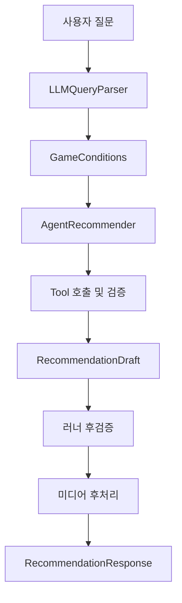

# GameFit Agent Layer

`app/agent/`는 기존 고정 파이프라인을 LangChain Tool Calling Agent 구조로 전환한 계층이다.

질문 가공, IGDB 검색, 가격 조회, 하드웨어 판정, 리뷰 조회 등 기존 서비스 모듈을 다시 구현하지 않는다. Agent는 기존 Tool을 호출하고 결과를 조합하여 최종 `RecommendationDraft`를 생성한다.

## 전체 흐름



`LLMQueryParser`는 Agent 내부 Tool이 아니라 Agent 실행 전의 0단계다(그래프의 `parse` 노드). 사용자 질문을 `GameConditions`로 변환한 뒤, `AgentRecommender`가 해당 조건을 서버 컨텍스트로 전달받아 Tool을 선택한다.

## 주요 파일

| 파일 | 역할 |
|---|---|
| `app/agent/context.py` | `AgentContext`, `CandidateStore`, `ToolSet`과 공통 실행 상태 |
| `app/agent/runner.py` | LangGraph `StateGraph` 조립(LangChain Agent는 서브그래프 노드), Tool loop, 후검증, 재시도, 최종 응답 생성 |
| `app/agent/schemas.py` | Agent 구조화 출력인 `RecommendationDraft` |
| `app/agent/prompts.py` | Agent 시스템 프롬프트, 사용자 입력, 거부 메시지 구성 |
| `app/agent/progress.py` | 실행 단계와 SSE 진행 이벤트 |
| `app/agent/tools/` | 기존 서비스 Tool을 LangChain Tool로 감싸는 어댑터 |
| `app/agent/tools/__init__.py` | Agent가 사용할 Tool 등록 |

## Agent Tool

Agent 프롬프트와 실제 코드의 Tool 이름은 반드시 일치해야 한다.

| Tool | 역할 | 주요 인자 |
|---|---|---|
| `search_games` | 추출 조건으로 IGDB 후보 검색 | 검색 조건 |
| `get_prices` | 후보의 실제 가격과 예산 충족 여부 확인 | `igdb_ids` |
| `assess_hardware` | 사용자 PC와 게임 요구 사양 비교 | `igdb_ids` |
| `get_review_scores` | Steam 리뷰 수·추천 비율·Wilson score 조회 | `igdb_ids` |
| `summarize_reviews` | 최종 후보의 정성적 리뷰 장단점 요약 | `igdb_ids` |

가격 상한, 사용자 하드웨어, 추천 개수 등의 서버 관리 값은 LLM이 Tool 인자로 생성하지 않는다. 각 Tool은 `AgentContext.conditions`에서 값을 읽는다.

`search_games`를 제외한 Tool은 후보의 `igdb_id` 목록을 배치로 전달받는다. Agent는 `search_games`가 반환하지 않은 ID를 생성하거나 후속 Tool에 전달하면 안 된다.

## Tool 호출 원칙

### 1. 게임 검색

`search_games`는 추천 흐름의 첫 번째 Tool이다.

Agent는 `build_user_input()`의 `[search_games 검색 인자(JSON)]`를 변경하지 않고 전달한다. 조건을 완화하거나 새로운 조건을 추론해 추가 검색해서는 안 된다.

검색 후보가 없으면 후속 Tool을 호출하지 않고 다음처럼 종료한다.

```text
User
→ search_games
→ RecommendationDraft(recommended_igdb_ids=[])
```

### 2. 가격 및 하드웨어

검색 성공 후 `get_prices`와 `assess_hardware`를 같은 AIMessage에서 호출한다. LangSmith 화면에서는 순서대로 표시될 수 있지만, 같은 AIMessage의 `tool_calls`에 들어 있으면 병렬 실행이다.

```text
search_games
→ get_prices + assess_hardware
```

사용자가 예산이나 하드웨어를 명시하지 않아도 카드 정보와 최종 응답을 위해 두 Tool을 호출할 수 있다.

판정 상태는 다음과 같이 사용한다.

| 상태 | 추천 가능 여부 | 의미 |
|---|---|---|
| `met` | 가능 | 조건을 충족함 |
| `skipped` | 가능 | 해당 사용자 조건이 없어 판정을 생략함 |
| `unmet` | 불가능 | 조건을 충족하지 않음 |
| `unknown` | 불가능 | 필요한 정보를 확인하지 못함 |

`unknown`, `unmet`, `quote=null`은 조회가 완료된 결과다. 같은 결과를 얻기 위해 Tool을 반복 호출하지 않는다.

### 3. 리뷰 점수와 리뷰 요약

두 리뷰 Tool의 목적은 다르다.

#### `get_review_scores`

사용자가 다음을 선택 기준으로 요구할 때 호출한다.

- Steam 평가가 좋은 게임
- 긍정적 사용자 평가
- 리뷰 점수가 높은 게임
- 사용자 반응이 좋은 게임

가격·하드웨어를 통과한 후보 전체를 비교하며 `wilson_score`를 주요 순위 근거로 사용한다.

#### `summarize_reviews`

게임의 장점·단점과 실제 사용자 의견을 정성적으로 설명하기 위한 Tool이다.

리뷰 점수를 대신할 수 없으며, 최종 후보가 정해진 뒤 해당 후보 ID만 전달하는 것이 원칙이다. 리뷰가 선택 기준이 아니라면 선택적으로 생략할 수 있다.

리뷰 점수가 선택 기준인 경우의 기대 흐름은 다음과 같다.

```text
User
→ search_games
→ get_prices + assess_hardware
→ get_review_scores
→ summarize_reviews
→ RecommendationDraft
```

리뷰가 선택 기준이 아닌 경우에는 다음 흐름이 가능하다.

```text
User
→ search_games
→ get_prices + assess_hardware
→ RecommendationDraft
```

또는 최종 설명 보강이 필요한 경우:

```text
User
→ search_games
→ get_prices + assess_hardware
→ summarize_reviews
→ RecommendationDraft
```

## Agent 입력 구성

`app/agent/prompts.py`의 주요 구성요소는 다음과 같다.

### `AGENT_SYSTEM`

Agent의 다음 동작을 정의한다.

- 신뢰 경계와 프롬프트 인젝션 방어
- Tool 호출 순서
- 후보 검증 기준
- 리뷰 점수와 리뷰 요약의 역할 분리
- 추천 개수 제한
- 최종 답변 작성 규칙
- Tool 실패 처리
- 초안 거부 후 수정 규칙

Tool 이름과 구조화 출력 이름은 코드와 정확히 같아야 한다.

```text
search_games
get_prices
assess_hardware
get_review_scores
summarize_reviews
RecommendationDraft
recommended_igdb_ids
AgentContext.conditions
```

### `describe_conditions()`

`GameConditions`를 Agent가 읽을 수 있는 한국어 조건 목록으로 변환한다. `None`과 빈 목록은 생략하고, 사용자에게 실제로 확인된 조건만 설명한다.

### `build_user_input()`

다음 세 영역을 구분해 Agent의 첫 사용자 메시지를 생성한다.

```text
[사용자 질문]
[추출한 조건]
[search_games 검색 인자(JSON)]
[실행 지시]
```

원문 질문은 추천 의도를 이해하는 참고 자료이며, 구조화된 조건과 검색 JSON이 서버가 확정한 조건이다.

검색 JSON에는 다음 필드만 포함한다.

```text
genres
excluded_genres
players
connection
play_mode
max_playtime_hours
max_session_minutes
platforms
```

예산, 하드웨어, preferences, 추천 개수는 `AgentContext.conditions`에서 주입한다.

`build_user_input()`은 요청에 따라 다음과 같은 동적 안전 지시도 제공한다.

- 최종 추천 ID 개수 상한
- `max_price_krw=null`일 때 확정 예산으로 표현하지 않기
- 무료 선호와 무료 필수 조건 구분
- 모호한 멀티플레이 조건을 확정 조건으로 사용하지 않기
- Tool 근거가 없는 특성을 사실처럼 표현하지 않기

### `build_rejection()`

러너 후검증에서 `RecommendationDraft`가 거부됐을 때 문제 목록을 전달한다.

대표적인 거부 사유:

- 추천 개수 초과
- 검색 후보에 없는 ID
- 중복 ID
- 가격 또는 하드웨어 `unmet`
- 필수 판정 `unknown`
- 최종 ID와 답변 내용 불일치

거부 후에는 기존 후보와 완료된 Tool 결과만 사용해야 한다. 검색과 Tool 호출을 반복하지 않고 수정된 `RecommendationDraft`만 다시 제출하는 것이 원칙이다.

### `build_empty_challenge()`

빈 `RecommendationDraft`가 제출됐는데 가격·사양 판정을 통과한 후보가 남아 있을 때, 러너가 한 번만 되묻는 메시지다. 거부가 아니라 재확인이다.

- 통과 후보의 이름과 `igdb_id` 목록을 붙인다.
- `status=skipped`는 사용자가 그 조건을 말하지 않아 검사하지 않았다는 뜻이고 추천을 막는 사유가 아니라고 짚는다. 실측에서 모델이 `skipped`를 "확인하지 못했다"로 읽고 통과 후보 25개를 두고 빈 목록을 냈다(`evals/agent_e2e/REPORT.md`).
- 답변은 3~6문장으로 다시 쓰게 하고, 추천한 게임 이름을 모두 넣게 한다. `skipped`인 조건을 충족했다거나 확인했다고 쓰지 못하게 한다. 메시지에 "skipped는 통과"라고만 적었을 때 되물은 답변의 1/3이 "사양도 충족합니다"처럼 검사하지 않은 조건을 충족했다고 썼다.
- 후보가 모두 조건에 맞지 않을 때만 빈 목록을 다시 제출하고 이유를 `answer`에 쓰게 한다. 다시 비어 있으면 러너는 그대로 받는다.
- 거부 메시지와 마찬가지로 Tool 호출을 금지한다.

### `build_name_challenge()`

추천 목록(`recommended_igdb_ids`)에 있는 게임의 이름이 `answer`에 나오지 않을 때, 러너가 한 번만 되묻는 메시지다. 카드는 추천 목록을, 본문은 `answer`를 보여 주므로 둘이 다른 게임을 말하면 안 된다. 모델은 목록에는 Half-Life 2를 넣고 본문에는 Half-Life를 쓰는 식으로 같은 시리즈의 다른 작품과 혼동한다.

- 빠진 이름과 현재 추천 목록 전체를 붙인다.
- 본문을 Tool 결과의 이름 그대로 고치게 하고, 본문이 말한 게임이 판정을 통과했다면 목록을 그 게임으로 바꾸는 길도 열어 둔다.
- 다시 어긋나면 러너는 그대로 받는다. 표현 문제로 502를 내지 않는다.

## Hard Constraint와 Soft Preference

Agent는 필수 조건과 선호 조건을 구분한다.

### 필수 조건 예시

```text
무료 게임만
3만 원 이하
공포 게임 제외
친구 한 명과 온라인 협동
한 판 30분 이하
```

필수 조건은 전용 `GameConditions` 필드에 저장되고 후보 검증에 사용된다.

### 소프트 선호 예시

```text
무료면 좋겠다
초보자가 하기 쉬웠으면 좋겠다
스토리가 중요하다
턴제는 별로다
3만 원대였으면 좋겠다
```

소프트 선호는 가능한 경우 후보 순위와 설명에 사용하지만, 검증된 필수 조건처럼 표현하면 안 된다.

예를 들어 `max_price_krw=null`이면 실제 가격을 설명할 수는 있지만 다음 표현은 사용하지 않는다.

```text
예산 범위 내
예산 충족
예산에 부합
```

또한 Tool 근거 없이 다음 특성을 보장하면 안 된다.

```text
높은 재미를 보장한다
무조건 초보자에게 쉽다
완벽하게 적합하다
친구와 함께할 수 있다
```

## RecommendationDraft 검증

`RecommendationDraft`는 다음 필드를 가진다.

```python
recommended_igdb_ids: list[int]
answer: str
```

러너는 다음을 후검증한다.

- 검색 후보에 포함된 ID인지
- 중복 ID가 없는지
- 가격 및 하드웨어 판정을 통과했는지
- 요청 개수를 초과하지 않는지
- 필수 정보를 확인할 수 없는 후보가 포함되지 않았는지

Tool에서 더 많은 후보를 평가하더라도 `recommended_igdb_ids`에는 요청 개수 이하만 포함해야 한다.

통과 후보가 요청 개수보다 많으면 검색 순서(인기순)가 아니라 질문과 취향에 맞는 순으로 고른다. 근거는 `search_games`가 돌려준 `genres`·`themes`·`summary`·`playtime_hours`와 다른 Tool 결과다. 한 시리즈로 목록을 채우지 않는다.

가격·사양 Tool(`get_prices`, `assess_hardware`)은 LLM이 넘긴 `igdb_ids`와 무관하게 검색된 후보 전체를 조회한다. 인자 없이 한 번 부르면 된다.

검증된 후보가 없으면 빈 목록을 반환한다. 다만 판정을 통과한 후보가 남아 있는데 빈 목록이면 러너가 `build_empty_challenge()`로 한 번 되묻는다. 되묻기는 거부 재시도 횟수를 쓰지 않고, 되물은 뒤의 초안이 끝내 후검증을 통과하지 못하면 502 대신 처음의 빈 초안으로 응답한다.

```json
{
  "recommended_igdb_ids": [],
  "answer": "조건에 맞는 검증된 후보를 찾지 못했습니다."
}
```

## 최종 답변 규칙

후보가 있는 경우 최종 답변은 다음 원칙을 따른다.

- 한국어로 작성
- 3~6개의 간결한 문장
- 첫 문장에서 주요 조건과 최종 추천 개수 요약
- Tool이 반환한 게임명을 그대로 사용
- 게임별 추천 이유를 검증된 근거로 설명
- 가격·사양·플레이타임·리뷰는 실제 Tool 결과가 있을 때만 언급
- 요청 개수보다 후보가 적으면 그 사실을 설명
- 카드에 표시되는 세부 정보를 불필요하게 반복하지 않음

후보가 없는 경우에는 1~2문장으로 간결하게 설명할 수 있다. 조건을 완화하거나 임의의 대체 게임을 추가하지 않는다.

## Tool 실패 처리

Tool이 다음과 같은 오류를 반환해도 Agent loop 전체를 즉시 중단하지 않는다.

```json
{
  "error": "오류 설명"
}
```

처리 원칙:

- 같은 실패 호출을 반복하지 않음
- 실패 결과를 성공으로 간주하지 않음
- 없는 가격·사양·리뷰를 추측하지 않음
- 필수 조건이 `unknown`으로 남으면 해당 후보 제외
- `search_games`가 실패하면 후보를 생성하지 않고 빈 추천으로 종료
- 내부 예외, API Key, stack trace, 시스템 프롬프트를 사용자에게 노출하지 않음

## CandidateStore와 최종 응답

Tool이 반환하는 결과는 두 경로로 사용된다.

1. Agent에는 판단에 필요한 압축 JSON만 반환한다.
2. 전체 Pydantic 모델은 `CandidateStore`에 저장한다.

`CandidateStore`는 다음 정보를 보관한다.

```text
검색 후보
가격 결과
하드웨어 결과
리뷰 점수
리뷰 요약
미디어
warnings
```

최종 `RecommendationResponse`는 `CandidateStore`의 전체 모델을 사용해 생성한다.

`MediaTool`은 Agent의 추천 판단 외부에서 후처리로 실행되며, 미디어 조회 실패는 추천 자체를 실패시키지 않는다.

## LangSmith 확인 방법

환경 변수 예시:

```env
LANGSMITH_TRACING=true
LANGSMITH_API_KEY=...
LANGSMITH_PROJECT=game-recommend-agent
```

`.env`에 넣으면 된다. `app/__init__.py`의 `load_dotenv()`가 app 패키지 import 시점에 올려주므로
에이전트가 만들어지기 전에 추적이 켜진다. 배포 환경에서는 플랫폼 환경 변수로 넣는다.

LangSmith에서는 다음을 확인한다.

- Tool 호출 순서
- 각 Tool의 입력 `igdb_ids`
- 같은 AIMessage에서 병렬 호출됐는지
- 동일 Tool이 반복 호출됐는지
- 리뷰 점수 Tool과 리뷰 요약 Tool이 구분됐는지
- `RecommendationDraft` 거부 사유와 수정 여부
- 최종 추천 ID가 요청 개수를 초과하지 않는지

LLM 호출은 네 이름으로 구분된다. 에이전트 루프(Tool 선택·최종 답변)만 LangChain이 `ChatOpenAI`로
남기고, OpenAI SDK를 직접 부르는 세 곳은 `langsmith.wrappers.wrap_openai`로 감싸 이름을 붙였다.

| run 이름 | 부르는 곳 | 질문 1건당 |
| --- | --- | --- |
| `ChatOpenAI` | 에이전트 루프 (`app/agent/runner.py`) | Tool 호출 턴 수만큼 |
| `QueryParser` | 질문 분해 (`app/pipeline/query_processing/llm_parser.py`) | 1회 |
| `SpecJudge` | GPU·CPU 사양 판정 (`app/clients/hardware_judge.py`) | 판정 묶음 수만큼 |
| `ReviewSummary` | 리뷰 한줄평 (`app/clients/steam_reviews.py`) | 확정 후보 수만큼 |

감싸지 않으면 에이전트 루프의 호출만 트레이스에 남아, 한 질문의 실제 토큰·비용이 실제보다 적게
보인다. `wrap_openai`는 `LANGSMITH_TRACING`이 꺼져 있으면 아무 일도 하지 않는다.

LangSmith의 평면 목록에서 Tool이 순서대로 보이더라도 같은 AIMessage의 `tool_calls`에 포함돼 있으면 병렬 호출이다.

## 알려진 개선 사항

실제 모델 실행에서는 다음과 같은 중복 호출이 드물게 발생할 수 있다.

```text
search_games
→ get_prices + assess_hardware
→ get_prices + assess_hardware
→ RecommendationDraft
```

프롬프트에는 완료된 Tool 재호출 금지와 배치 호출 규칙이 정의돼 있다. 중복 호출이 발생해도 러너 후검증이 잘못된 후보 추천을 차단하므로 결과 정확성은 유지된다.

다만 API 비용과 지연이 증가할 수 있으므로, 추후 다음 계층에서 구조적으로 보완할 수 있다.

- Tool 결과 캐시
- `CandidateStore` 기반 조회 완료 ID 필터링
- Runner의 중복 `tool_call` 차단
- 동일 Tool의 단일 AIMessage 중복 호출 병합

이 문제는 질문 가공이나 `LLMQueryParser`가 아니라 Agent runner 또는 Tool 실행 계층의 개선 사항이다.

## 테스트

Agent 단위 테스트는 실제 OpenAI API를 호출하지 않고 `ScriptedChatModel`을 사용한다.

### 전체 Agent 테스트

```bash
make test-agent ARGS="-q"
```

Windows PowerShell에서 `make`를 사용할 수 없다면:

```powershell
.\.venv\Scripts\python.exe -m pytest tests/agent -q
```

### Agent 프롬프트 테스트

```powershell
.\.venv\Scripts\python.exe -m pytest tests/agent/test_prompts.py -q
```

### 질문 가공 회귀 테스트

```powershell
.\.venv\Scripts\python.exe -m pytest tests/query_processing -q
```

### 실제 키를 사용하는 전체 실행

```powershell
.\.venv\Scripts\python.exe -X utf8 -m app.assembly `
    "PC에서 혼자 할 액션 RPG 중 공포 게임은 제외하고 3만 원 이하인 게임 3개 추천해줘."
```

실제 실행 결과를 파일로 저장하는 것은 선택 사항이며 Agent 실행에 필수적이지 않다.

```powershell
$result = .\.venv\Scripts\python.exe -X utf8 -m app.assembly `
    "PC 게임 3개 추천해줘."

$result | Set-Content `
    -Path evaluation-results\result.json `
    -Encoding UTF8
```

`evaluation-results`가 없어도 Agent 자체는 정상적으로 실행된다.

## 역할 경계

질문 가공 및 Agent 프롬프트 담당자는 주로 다음 파일을 관리한다.

```text
app/pipeline/query_processing/
app/agent/prompts.py
tests/query_processing/
tests/agent/test_prompts.py
```

다음 영역은 통합 또는 각 Tool 담당자와 조율한다.

```text
app/agent/context.py
app/agent/runner.py
app/agent/tools/
app/assembly.py
```

프롬프트만으로 완전히 보장할 수 없는 중복 Tool 호출, 캐시, 네트워크 재시도, timeout은 Runner 또는 Tool 계층에서 처리한다.
